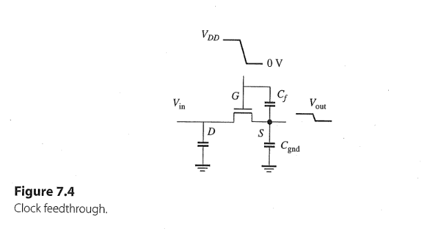
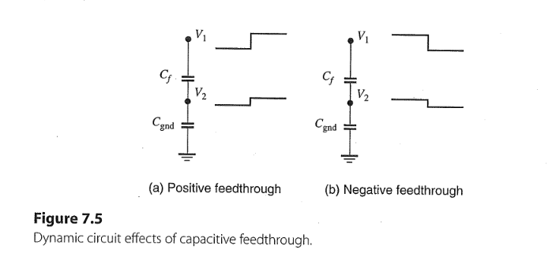
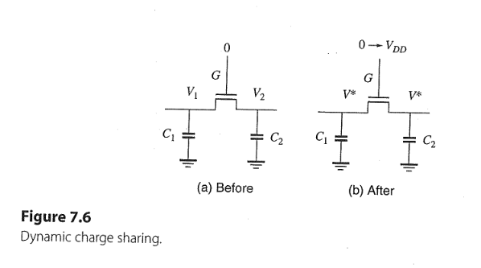
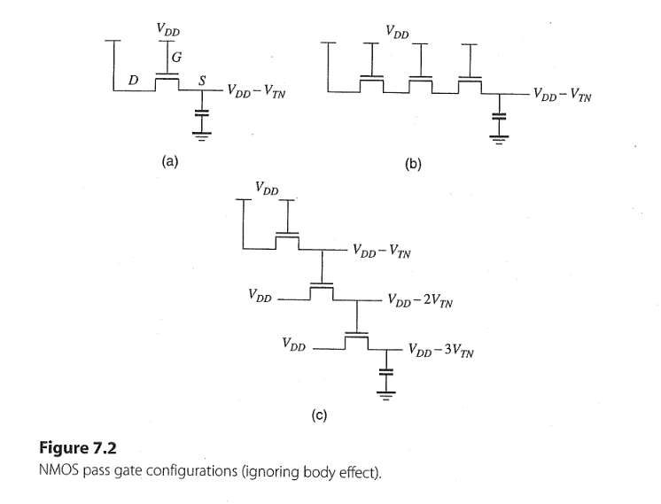
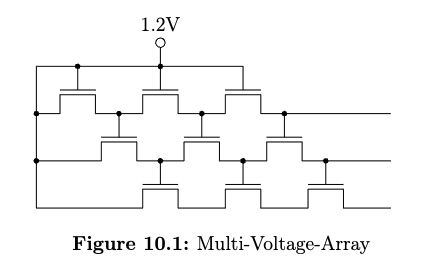
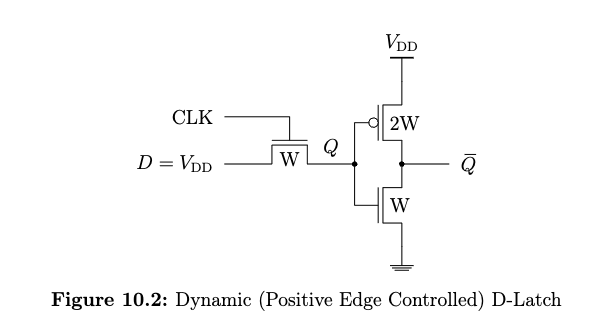

## Task 10.1

### Clock feedthrough

- A pass transistor, Gate drived by clock signal
- A cap. $C_f$ between the gate and output node
- If the control signal undergoes from $V_{DD}$ to 0V $\Rightarrow$ cut off 
- Output is in the high-Z state since $V_{GS} < V_{TN}$
- $C_f$ and $C_{gnd}$ are isolated from other circuits 
- As the gate voltage $\downarrow$ $\Rightarrow$ $V_{out}$ $\downarrow$, vice versa
- The small replica of the clock signal at the output is called clock feedthrough effect
---

- $$C_f(V_1 - V_2) = C_{gnd}V_2$$
- $$V_2  = \frac{C_f V_1}{C_f + C_{gnd}}$$
- $$ \Delta V_2  = \frac{C_f \Delta V_1}{C_f + C_{gnd}}$$
- If $C_f \gg C_{gnd} \Rightarrow \Delta V_2 \approx \Delta V_1$
- If $C_{gnd} \gg C_f \Rightarrow \Delta V_2 \approx 0$
- To reduce the feedthrough effect, $C_{gnd} \gg C_f$

---
### Charge Sharing 

- If a pass transistor switches on, the charge redistributes until reach at equilibrium.
- $$Q_{\text{total}} = C_1V_1 + C_2V_2 = (C_1 + C_2)V^{\star}$$ 
- $$V^{\star} = \frac{C_1V_1 + C_2V_2}{C_1+C_2} \tag{7.3}$$
- If $V_1 = 0$ and $V_2 = V_{DD} - V_{TN}$: $$V^{\star} = \frac{C_2}{C_1+C_2}(V_{DD}-V_{TN}) < V_2$$
- To ensure $V_2 \geq V_{DD}/2(\text{switching threshold})$ of next stage, $\Rightarrow C_2 \gg C_1$

--- 
## Task 10.2 

- In figure (b) all output nodes have same output $V_{DD} - V_{TN}$
- In figure (c), in the successive pass transistors, the gate voltage is $V_{TN}$ lower than previous one, should be avoided.

---

- First row, $V_{out} = V_{DD} - V_{TN}(V_{SB})$
  - $$V_{out} = V_{DD} - \big[V_{T0} + \gamma (\sqrt{V_{SB} + 2|\phi_F|} - \sqrt{2|\phi_F|} )\big] \\ = 1.2 \mathrm{V} - \big[0.4 \mathrm{V} + 0.2 \mathrm{V^{1/2}} (\sqrt{V_{out} + 0.88 \mathrm{V}} - \sqrt{0.88 \mathrm{V}} )\big] \\ = 0.8 \mathrm{V} - 0.2 \mathrm{V^{1/2}} \sqrt{V_{out} + 0.88 \mathrm{V}} +   0.2 \mathrm{V^{1/2}}\sqrt{0.88 \mathrm{V}} \\ = 0.99 \mathrm{V} - 0.2 \mathrm{V^{1/2}} \sqrt{V_{out} + 0.88 \mathrm{V}} $$
  - Resolving by iteration, starting $V_{out, old} = 1.2 \mathrm{V}$
  -   | i   | $V_{out, old}$ | $V_{out, new}$ |
      |-----|--------|--------|
      | 1   | 1.20 V | 0.70 V |
      | 2   | 0.70 V | 0.74 V |
      | 3   | 0.74 V | 0.73 V |
      | 4   | 0.73 V | 0.73 V |
  

- Second row, $V_{out} = V_{DD} - 2V_{TN}(V_{SB})$
  - $$V_{out} = V_{DD} - 2\times\big[V_{T0} + \gamma (\sqrt{V_{SB} + 2|\phi_F|} - \sqrt{2|\phi_F|} )\big] \\ = 1.2 \mathrm{V} - 2\times\big[0.4 \mathrm{V} + 0.2 \mathrm{V^{1/2}} (\sqrt{V_{out} + 0.88 \mathrm{V}} - \sqrt{0.88 \mathrm{V}} )\big] \\ = 0.4 \mathrm{V} - 0.4 \mathrm{V^{1/2}} \sqrt{V_{out} + 0.88 \mathrm{V}} +   0.4 \mathrm{V^{1/2}}\sqrt{0.88 \mathrm{V}} \\ = 0.78 \mathrm{V} - 0.4 \mathrm{V^{1/2}} \sqrt{V_{out} + 0.88 \mathrm{V}} $$
  - Resolving by iteration, starting $V_{out, old} = 0.73 \mathrm{V}$
  -   | i   | $V_{out, old}$ | $V_{out, new}$ |
      |-----|--------|--------|
      | 1   | 0.73 V | 0.27 V |
      | 2   | 0.27 V | 0.35 V |
      | 3   | 0.35 V | 0.34 V |
      | 4   | 0.34 V | 0.34 V |
- Third row, $V_{out} = V_{DD} - 3V_{TN}(V_{SB})$
  - $V_{GS} < V_{TN}(V_{SB}) \Rightarrow V_{out} = 0$

---
## Task 10.3 

- For CLK transitions from LOW to HIGH, 
  - $V_Q$: $$V_{out} = V_{DD} - \big[V_{T0} + \gamma (\sqrt{V_{SB} + 2|\phi_F|} - \sqrt{2|\phi_F|} )\big] \\ = 1.8 \mathrm{V} - \big[0.5 \mathrm{V} + 0.3 \mathrm{V^{1/2}} (\sqrt{V_{out} + 0.84 \mathrm{V}} - \sqrt{0.84 \mathrm{V}} )\big] \\ = 1.3 \mathrm{V} - 0.3 \mathrm{V^{1/2}} \sqrt{V_{out} + 0.84 \mathrm{V}} +   0.3 \mathrm{V^{1/2}}\sqrt{0.84 \mathrm{V}} \\ = 1.57 \mathrm{V} - 0.3 \mathrm{V^{1/2}} \sqrt{V_{out} + 0.84 \mathrm{V}} $$
  - Resolving by iteration, starting $V_{out, old} = 1.8 \mathrm{V}$
  -   | i   | $V_{out, old}$ | $V_{out, new}$ |
      |-----|--------|--------|
      | 1   | 1.80 V | 1.08 V |
      | 2   | 1.08 V | 1.15 V |
      | 3   | 1.15 V | 1.15 V |
   
   - In CMOS inverter, PMOS is in saturation region and NMOS is in linear region
     - $$I_{\text{SD, P}}(\text{sat}) = I_{\text{DS, N}}(\text{lin})$$
     - $$\frac{W_Pv_{\text{sat}}C_{ox}(V_{\text{SG,P}}-|V_{TP}|)^2}{V_{\text{SG, P}} -|V_{TP}| + E_{CP}L_P} = \frac{W_N\mu_N C_{ox}\Big[(V_{\text{GS,N}} - V_{TN})V_{\text{DS,N}} - V_{\text{DS,N}}^2/2\Big]}{L_N + V_{\text{DS,N}}/E_{CN}} $$
     - $$\frac{W_Pv_{\text{sat}}C_{ox}(V_{DD}-V_Q-|V_{TP}|)^2}{V_{DD}-V_Q -|V_{TP}| + E_{CP}L_P} = \frac{W_N\mu_N C_{ox}\Big[(V_Q - V_{TN})V_{\overline{Q}} - V_{\overline{Q}}^2/2\Big]}{L_N + V_{\overline{Q}}/E_{CN}}  $$
     - With $V_{\overline{Q}}/E_{CN} \approx 0$ and $V_{\overline{Q}}^2/2 \approx 0 \Rightarrow$ $$ V_{\overline{Q}} \approx \frac{W_PL_Nv_{\text{sat}}C_{ox}(V_{DD}-V_Q-|V_{TP}|)^2}{W_N\mu_N C_{ox}(V_Q - V_{TN})(V_{DD}-V_Q -|V_{TP}| + E_{CP}L_P)} \\ = 0.0080 \mathrm{V} \tag{10.1}$$

- For CLK transitions from HIGH to LOW, Feedthrough occurs at node Q
  - $C_{f} = C_{ol}\times W = 0.25 \mathrm{fF/\mu m} \times 0.2 \mathrm{\mu m} = 0.05 \mathrm{fF}$
  - $C_{gnd} = C_{SB} + C_{\text{in, inv}} = C_j W + 3C_g W = 0.5 \times 0.2 \mathrm{fF} + 3\times2\times0.2 \mathrm{fF} = 1.38 \mathrm{fF}$
  - According to eq. (7.3): $$\Delta V_Q = \frac{C_{f}\Delta V_{CLK}}{C_{f} + C_{gnd}} = \frac{0.05 \times (-1.8 \mathrm{V})}{0.05 + 1.38} = -0.06 \mathrm{V}$$
  - The new voltage at Q: $V_Q = V_Q + \Delta V_Q = 1.15 \mathrm{V} - 0.06 \mathrm{V} = 1.09 \mathrm{V}$
  - According to eq. (10.1) $V_{\overline{Q}} \approx 0.016 \mathrm{V}$

---
## Task 10.4 
see blackboard 