## Task 11.1

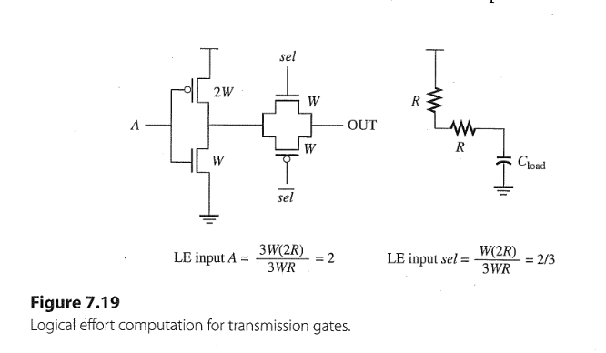

+ Logical Effort (LE) is the ratio of $\tau_{\text{gate}}/\tau_{\text{inv}} \ (\tau = R_{\text{eff}} C_{\text{in}})$
+ At input A, the $C_{\text{in, A}} = C_{\text{in, inv}} = C_g(W_n + W_p) = 3WC_g$
+ At input sel, the $C_{\text{in, sel}} = C_gW_n = WC_g$
+ For inverter its $R_{\text{inv}} = R_{\text{eqn}}(L/W)$
+ According to eq. (7.7) for TG. $$R_{\text{TG}} = R_{\text{eqn}}(L/W) \tag{7.7}$$
+ Due to $R_{\text{TG}} = R_{\text{inv}}$, $$LE(A) =\frac{\tau_{\text{gate}}}{\tau_{\text{inv}}} = \frac{(R_{\text{inv}} + R_{\text{TG}}) \cdot 3WC_g}{R_{\text{inv}} \cdot 3WC_g } = 2$$
+ $$LE(sel) = \frac{\tau_{\text{gate}}}{\tau_{\text{inv}}} = \frac{(R_{\text{inv}} + R_{\text{TG}}) \cdot W C_g}{R_{\text{inv}} \cdot  3WC_g} = 2/3$$
---

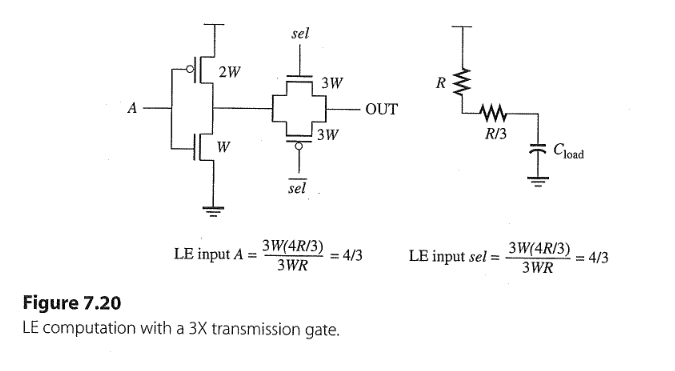

+ Increasing size of TG $\times 3 \Rightarrow R_{\text{TG}} = R_{\text{eqn}}(L/3W) = R_{\text{inv}}/3, C_{\text{in, sel}} = C_gW_n = (3W)C_g$
+  $$LE(A) =\frac{\tau_{\text{gate}}}{\tau_{\text{inv}}} = \frac{(R_{\text{inv}} + R_{\text{inv}}/3) \cdot 3WC_g}{R_{\text{inv}} \cdot 3WC_g } = 4/3$$
+  $$LE(sel) = \frac{\tau_{\text{gate}}}{\tau_{\text{inv}}} = \frac{(R_{\text{inv}} +  R_{\text{inv}}/3) \cdot (3W) C_g}{R_{\text{inv}} \cdot  3WC_g} = 4/3$$
---
### Solution
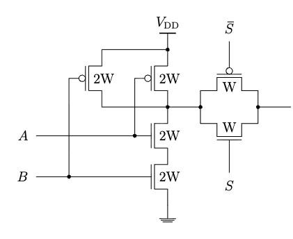

+ At node A, the $C_{\text{in, A}} = C_g(W_n + W_p) = 4WC_g$
+ For NAND2 its $R_{\text{NAND2}} = R_{\text{eqn}}(L/2W) +  R_{\text{eqn}}(L/2W) = R_{\text{eqn}}(L/W)$
+ At node S, the $C_{\text{in, S}} = C_gW_n = WC_g$, its $R_{\text{TG}} = R_{\text{eqn}}(L/W)$
+ According to $R_{\text{NAND2}} = R_{\text{TG}} = R_{\text{inv}}$, $$LE(A) =\frac{\tau_{\text{gate}}}{\tau_{\text{inv}}} = \frac{(R_{\text{NAND2}} + R_{\text{TG}}) \cdot 4WC_g}{R_{\text{inv}} \cdot 3WC_g } = 8/3$$
+ $$LE(S) =\frac{\tau_{\text{gate}}}{\tau_{\text{inv}}} = \frac{(R_{\text{NAND2}} + R_{\text{TG}}) \cdot WC_g}{R_{\text{inv}} \cdot 3WC_g } = 2/3$$
---

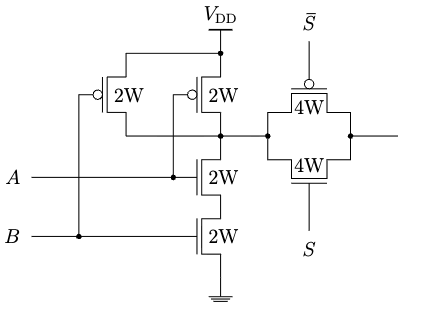

+ NAND2 keeps same but for TG. the $C_{\text{in, S}} = C_gW_n = (4W)C_g$, its $R_{\text{TG}} = R_{\text{eqn}}(L/4W)$

+ $$LE(A) =\frac{\tau_{\text{gate}}}{\tau_{\text{inv}}} = \frac{(R_{\text{eqn}}(L/W) + R_{\text{eqn}}(L/4W)) \cdot 4WC_g}{R_{\text{eqn}}(L/W) \cdot 3WC_g } = 5/3$$
+ $$LE(S) =\frac{\tau_{\text{gate}}}{\tau_{\text{inv}}} = \frac{(R_{\text{eqn}}(L/W) + R_{\text{eqn}}(L/4W)) \cdot (4W)C_g}{R_{\text{eqn}}(L/W) \cdot 3WC_g } = 5/3$$
---

## Task 11.2

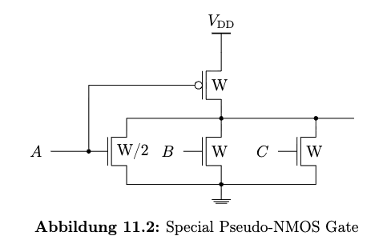

### a) LE(A) = ?
+ $\tau_{\text{gate}} = C_{\text{in}}\cdot R_{\text{eff}} = C_g(W + W/2) \cdot R_{\text{eqn}}L/(W/2) = 3 C_g R_{\text{eqn}}L$
+ $\tau_{\text{inv}} = C_{\text{in}}\cdot R_{\text{eff}} = C_g(2W + W) \cdot R_{\text{eqn}}L/W = 3 C_g R_{\text{eqn}}L$
+ $$LE(A) = \frac{\tau_{\text{gate}}}{\tau_{\text{inv}}} = 1$$

### b) LE(B) = LE(C) = ?
+ Consider the PU-case $\Rightarrow R_{\text{eff}} = R_{\text{eqp}}L/W$
+ Due to $R_{\text{eqp}} \approx 2 R_{\text{eqn}}$, $$\tau_{\text{gate}} = C_{\text{in}}\cdot R_{\text{eff}} = C_gW \cdot R_{\text{eqp}}L/W   \approx 2 C_g R_{\text{eqn}}L$$
+ $$LE(B) = \frac{\tau_{\text{gate}}}{\tau_{\text{inv}}} \approx \frac{2}{3}$$

--- 

## Task 11.3

### 2 to 1 MUX using TG

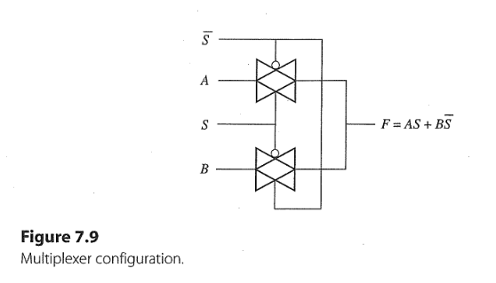

+ if S = 1, upper TG is on, F = A 
+ if S = 0, lower TG is on, F = B 

---
### 4 to 1 MUX using TG 
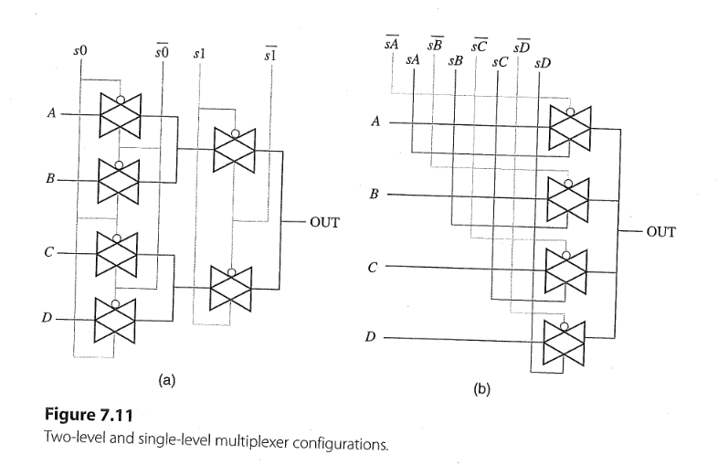

+ For (a): $$\text{OUT} = \overline{s1} (A \cdot \overline{s0} + B \cdot s0) + s1(C \cdot \overline{s0} + D \cdot s0) \\ = A \overline{s1} \ \overline{s0} + B \overline{s1} s0 + C s1 \overline{s0} + D s1 s0  $$
  + Only two control signals s0 and s1 and their complements

+ For (b): $$\text{OUT} = A \cdot sA + B \cdot sB + C \cdot sC + D \cdot sD$$
  + requies four control signals sA, sB, sC, sD and their complements

+ For both types, the control signals must be setted up to turn only one path on at a time (see on page 322), its called also one-hot MUX.

---
### TG Cap. in ON and OFF states

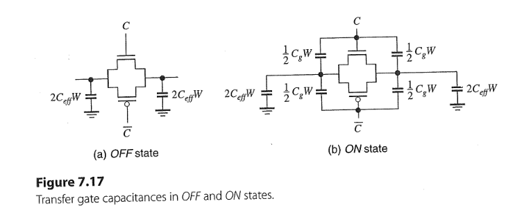

+ If TG is off, $C_{GS}$ and $C_{GD}$ are zeros, only $C_{ol}$ are left ($W_n = W_p$)
  + $$C_{\text{in, TG, off}} = C_{\text{out, TG, off}} = 2 C_{\text{eff}}W \tag{7.9}$$
+ If TG is on, assume PMOS and NMOS both in linear region, $C_{GS} = C_{GD} = C_G/2$
  + $$C_{\text{in, TG, on}} = C_{\text{out, TG, on}} = 2 C_{\text{eff}}W + C_g W \tag{7.11}$$

---
### Solution
#### Calculate the elmore delays (one path of MUX = RC ladder)

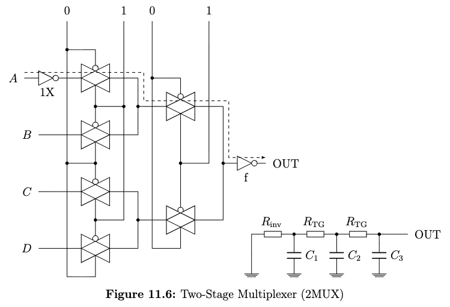

+ For 2MUX
  + the load cap. $C_1$ ($C_{\text{wire}} \approx 0$): $$C_1 =  C_{\text{self, inv}} +  C_{\text{in, TG, on}}\\ = C_{\text{eff}}3W + (2C_{\text{eff}}W + C_g W) \\ = C_{\text{eff}}5W + C_g W$$
  + the load cap. $C_2$: $$C_2 = C_{\text{out, TG, on}} + C_{\text{out, TG, off}} +  C_{\text{in, TG, on}} \\ = (2C_{\text{eff}}W + C_g W) + 2C_{\text{eff}}W +(2C_{\text{eff}}W + C_g W) \\ = C_{\text{eff}}6W + C_g2W$$
  + the load cap. $C_3$: $$C_3 = C_{\text{out, TG, on}} + C_{\text{out, TG, off}} +  C_{\text{in, inv}} \\ = (2C_{\text{eff}}W + C_g W) + 2C_{\text{eff}}W + C_g 3W  \cdot f\\ = C_{\text{eff}}4W + C_g(1+3f)W $$

  + the elmore delay of 2MUX: $$t_{\text{Elmore, 2MUX}} = R_{\text{inv}}C_1 + (R_{\text{inv}} + R_{TG})C_2 + (R_{\text{inv}} + 2R_{TG})C_3$$

  + Assuming $R_{\text{inv}} = R_{TG} = R \Rightarrow$ $$ t_{\text{Elmore, 2MUX}} = R(C_1 + 2C_2 + 3 C_3)\\ = R(29C_{\text{eff}} + 8 C_g + 9f C_g)W$$

---
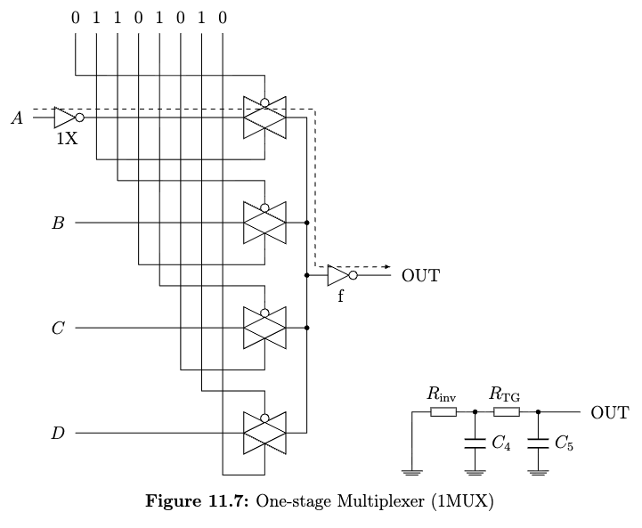

+ For 1MUX
  + the load cap. $C_4$ ($C_{\text{wire}} \approx 0$): $$C_4 =  C_{\text{self, inv}} +  C_{\text{in, TG, on}}\\ = C_{\text{eff}}3W + (2C_{\text{eff}}W + C_g W) \\ = C_{\text{eff}}5W + C_g W$$
  + the load cap. $C_5$: $$C_5 = C_{\text{out, TG, on}} + 3C_{\text{out, TG, off}} +  C_{\text{in, inv}} \\ = (2C_{\text{eff}}W + C_g W) + 3\cdot 2C_{\text{eff}}W + C_g 3W  \cdot f \\ = C_{\text{eff}}8W + C_g(1+3f)W$$
  

  + the elmore delay of 1MUX: $$t_{\text{Elmore, 1MUX}} = R_{\text{inv}}C_4 + (R_{\text{inv}} + R_{TG})C_5$$

  + Assuming $R_{\text{inv}} = R_{TG} = R \Rightarrow$ $$ t_{\text{Elmore, 1MUX}} = R(C_4 + 2C_5)\\ = R(21C_{\text{eff}} + 3C_g + 6f C_g)W$$

+ 2MUX versus 1MUX
  + 2MUX is slower than 1MUX but 1MUX requires more routing resources (i.e., more inverters for control signals)

--- 
## Task 11.4 
+ The logical effort of a CMOS gate (NAND3, NOR4, etc) does not change with the same scale of PU and PD width ($\uparrow W \Rightarrow  C \uparrow, R \downarrow \Rightarrow \tau \updownarrow$).
+ See reference solution

---
## Task 11.5 

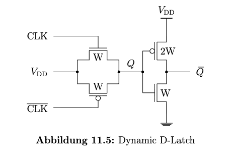

+ for CLK toggles from LOW to HIGH, TG on, $V_Q = V_{DD} = 1.8 V, V_{\overline{Q}} = 0$
+ for CLK toggles from HIGH to LOW, TG off, at node Q, the feedthrough is canceled by $\overline{\text{CLK}}$ toggles from LOW to HIGH, no clock feedthrough effect
+ Calculating the delay of CLK from LOW to HIGH 
  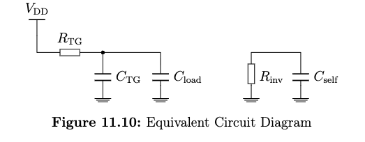
  
  + $t_{\text{PHL}} = R_{TG}(C_{\text{out, TG, on}} + C_{\text{in, inv}}) + R_{\text{inv}}C_{\text{load}} \\ = R_{\text{eqn}} (2C_{\text{eff}}W + C_g W + C_g 3W)+ R_{\text{eqn}}3C_{\text{eff}}W \\ = R_{\text{eqn}}(5 C_{eff} + 4 C_g)W \\ = (12.5 \cdot 10^3 \Omega)(5\cdot 1 + 4\cdot2)( 10^{-15} \text{F/}\mu m )(0.2 \mu m ) \\ = 32.5 \text{ps} $