## Task 12.1

### Background

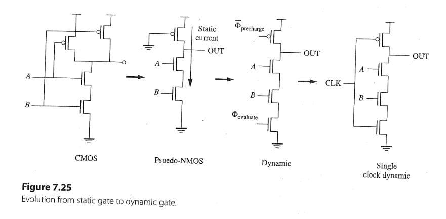

+ CMOS requires numerous PMOS with large sizes.
+ Pseudo-NMOS suffers static power dissipation when the output is low.
  + How can we turn off PMOS in case of $V_{\text{ol}}$?
  + A new clock signal $\overline{\Phi}_{\text{precharge}}$, turns PMOS on or off as needed.
  + Another clock signal $\Phi_{\text{evaluate}}$, only turns on when PMOS off.
  + Using $\text{CLK}$ to drive $\overline{\Phi}_{\text{precharge}}$ and $\Phi_{\text{evaluate}}$ $\Rightarrow$ dynamic NAND2

---

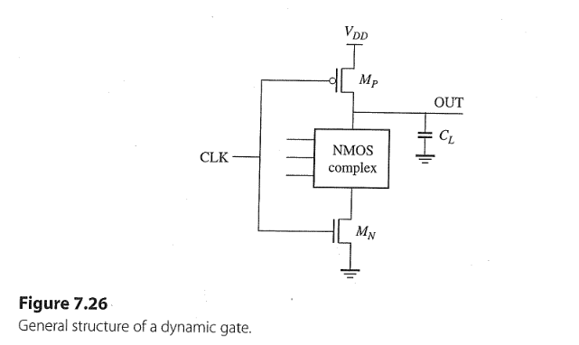

+ $M_P$ precharge transistor, $M_N$ evaluate transistor.
+ Comparing to pseudo-NMOS, only $M_N$ extra.
+ CLK is required for all dynamic gates to operate properly.

---
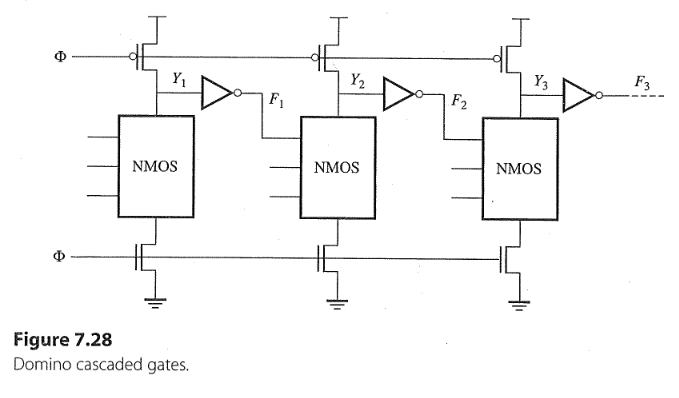

+ 3 domino logic stages circuits.
+ When $\Phi$ is LOW, all stages are precharged simultaneously.
+ When $\Phi$ is HIGH, $Y_1$, $Y_2$ and $Y_3$ may fall like dominos from left to right.
+ An asymmetric clock with a high duty cycle is needed for this domino logic stages.

---
### Solution

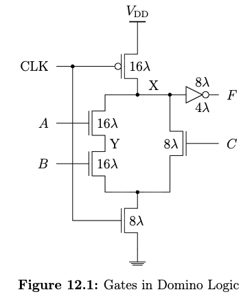

+ Function: $F = AB + C$
+ Clock feedthrough:
  + When CLK from LOW to HIGH, $M_P$ in linear region
  + $$C_f = C_{GD} + C_{ol}W_P \\ = (1/2 \cdot C_g + C_{ol})W_P \\ = (1 \mathrm{fF/\mu m} + 0.25 \mathrm{fF/\mu m} )(16 \cdot 0.05 \mathrm{\mu m}) = 1 \mathrm{fF}$$
  + $$C_{GND} = C_{\text{self}} + C_{\text{fanout}} \\\approx  C_{eff}(16 \lambda + 16 \lambda + 8 \lambda) + C_g (8 \lambda + 4 \lambda) \\ = (1 \mathrm{fF/\mu m})(40 \cdot 0.05\mathrm{\mu m}) + (2 \mathrm{fF/\mu m})(12 \cdot 0.05\mathrm{\mu m}) = 3.2 \mathrm{fF} $$
  + $$\Delta V_X = \frac{C_f \Delta V_{CLK}}{C_f + C_{GND}} = \frac{1 \cdot 1.2}{1 + 3.2} \mathrm{V} \approx 0.29 \mathrm{V} $$
  + The new $V_X = 1.2 + 0.29 \mathrm{V} > V_{DD}$, no negative effect for logical one. 

+ Charge sharing:
  + The worst-case assignment: $V_X = 1.2 \mathrm{V}$, $A = 1, B = C = 0$
  + $C_X = C_{GND} = 3.2 \mathrm{fF}, C_Y = C_{eff}(16\lambda) = (1 \mathrm{fF/\mu m}) (16 \cdot 0.05 \mathrm{\mu m}) = 0.8 \mathrm{fF}$
  + The ideal new voltage at X and Y : $$V^{\star} = \frac{Q_{\text{total}}}{C_X + C_Y}  = \frac{C_X V_X + C_Y V_Y}{C_X + C_Y} = \frac{3.2 \cdot 1.2 \mathrm{V}}{3.2 + 0.8} = 0.96 \mathrm{V}$$
  + The actual maximum $V_Y = V_{DD} - V_{TN}(V_{SB}) =  0.73 \mathrm{V}$
  + The rest charge at X : $$Q_{\text{rest}} = Q_{\text{total}} - C_Y V_Y = 3.2 \mathrm{fF} \cdot 1.2 \mathrm{V} - 0.8 \mathrm{fF} \cdot 0.73 \mathrm{V} = 3.26 \mathrm{fC}$$
  + The actual remain Voltage at X: $$V_X = \frac{Q_{\text{rest}}}{C_X} \approx 1.02 \mathrm{V} > V_S \Rightarrow \text{no functional error, no risk, but suffers charge sharing effect}$$

--- 
#### Quiz: How can we minimize the charge sharing effect?
+ Increasing $C_X$ by load (i.e., inverter)
+ Using keepers (feedback path) to hold the output HIGH
  + in (a), the weak PMOS continues to pull up the node back to $V_{DD}$
  + since the NMOS path must overpower the PMOS so, $(W_P/L_P) \downarrow$, very large PMOS $\Rightarrow$ larger $C_{\text{inv, out}}$ 
    + To address this issue, in (b) uses a minimum size PMOS and an always on but also long PMOS $\Rightarrow$ additional power dissipation

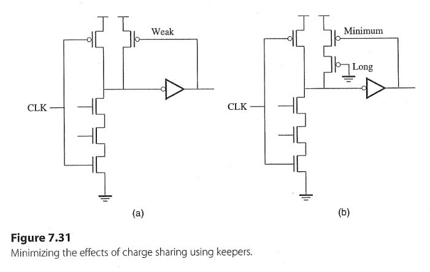

---

## Task 12.2 

### Background 

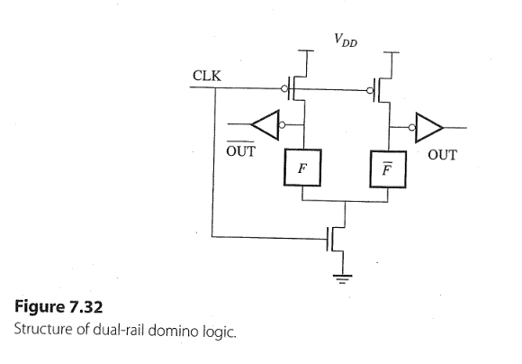

+ A complementary pair of outputs ($\overline{\text{OUT}}, \text{OUT}$)
+ Two precharge transistors force the outputs LOW when CLK is LOW
+ If CLK is HIGH, one of the outputs is HIGH depending on $F$ and $\overline{F}$

---

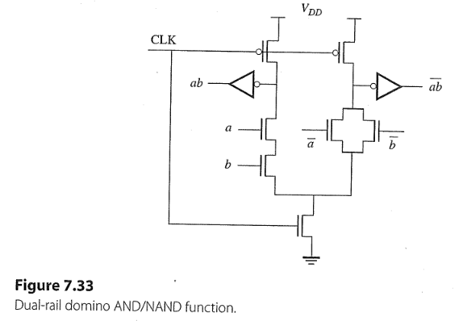
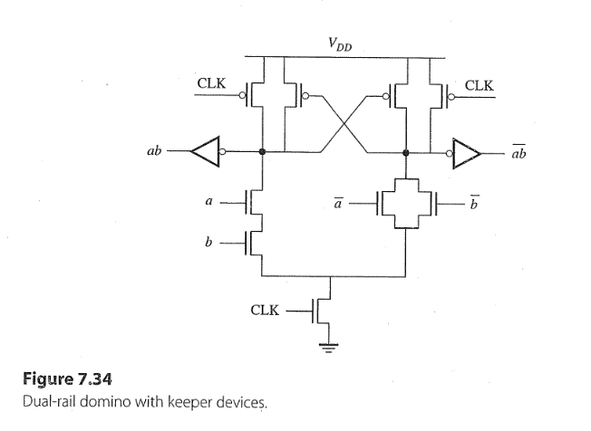

---

### Solution

+ See on the blackboard

---

## Task 12.3 

+ See on the blackboard and reference solution

---
## Task 12.4

### Solution 

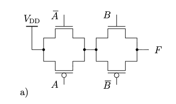

  |  A  |  B  |    F   |
  |-----|-----|--------|
  |  0  |  0  |   $Z$  |   
  |  0  |  1  |   $1$  |
  |  1  |  0  |   $Z$  |
  |  1  |  1  |   $Z$  |

---

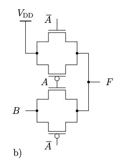

  |  A  |  B  |    F   |
  |-----|-----|--------|
  |  0  |  0  |   $1$  |   
  |  0  |  1  |   $1$  |
  |  1  |  0  |   $0$  |
  |  1  |  1  |   $1$  |

---

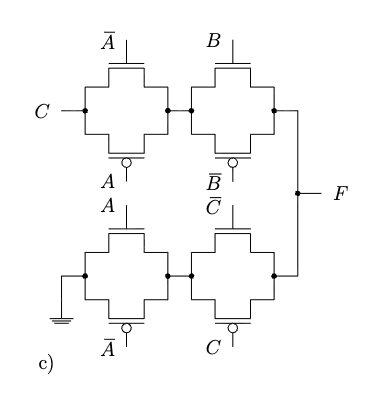

  |  A  |  B  |  C  |    F    |
  |-----|-----|-----|---------|
  |  0  |  0  |  0  |   $%Z$  |   
  |  0  |  0  |  1  |   $%Z$  |
  |  0  |  1  |  0  |   $%0$  |
  |  0  |  1  |  1  |   $%1$  |
  |  1  |  0  |  0  |   $%0$  |   
  |  1  |  0  |  1  |   $%Z$  |
  |  1  |  1  |  0  |   $%0$  |
  |  1  |  1  |  1  |   $%Z$  |

---

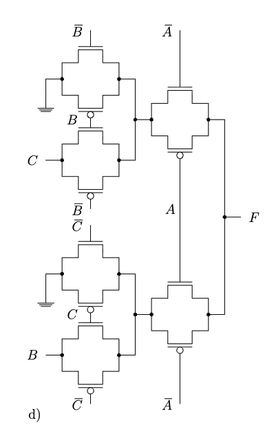

  |  A  |  B  |  C  |    F    |
  |-----|-----|-----|---------|
  |  0  |  0  |  0  |   $%0$  |   
  |  0  |  0  |  1  |   $%0$  |
  |  0  |  1  |  0  |   $%0$  |
  |  0  |  1  |  1  |   $%1$  |
  |  1  |  0  |  0  |   $%0$  |   
  |  1  |  0  |  1  |   $%0$  |
  |  1  |  1  |  0  |   $%0$  |
  |  1  |  1  |  1  |   $%1$  |

## Task 12.5 

+ See on the blackboard or the reference solution