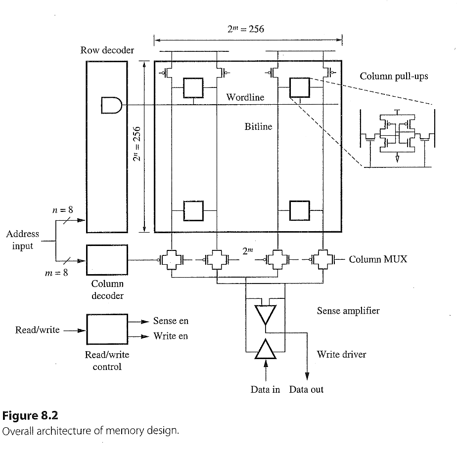
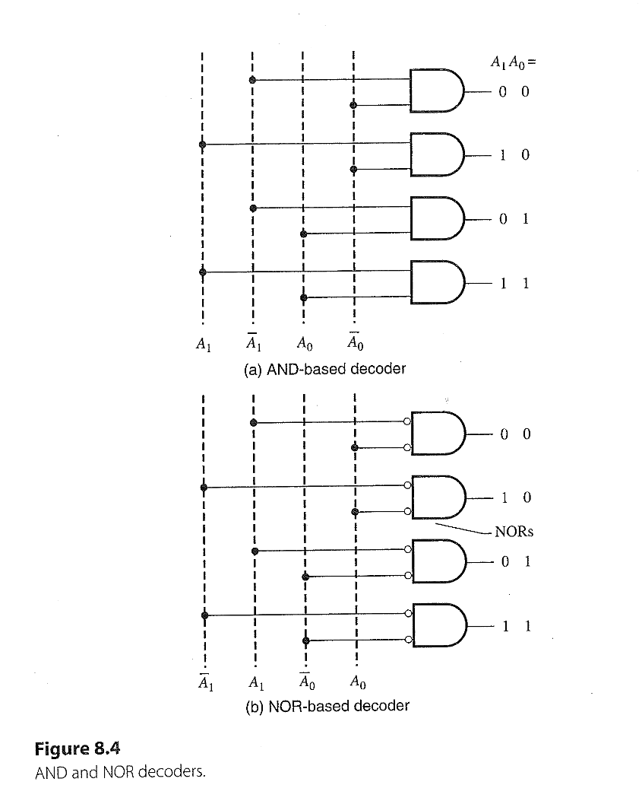
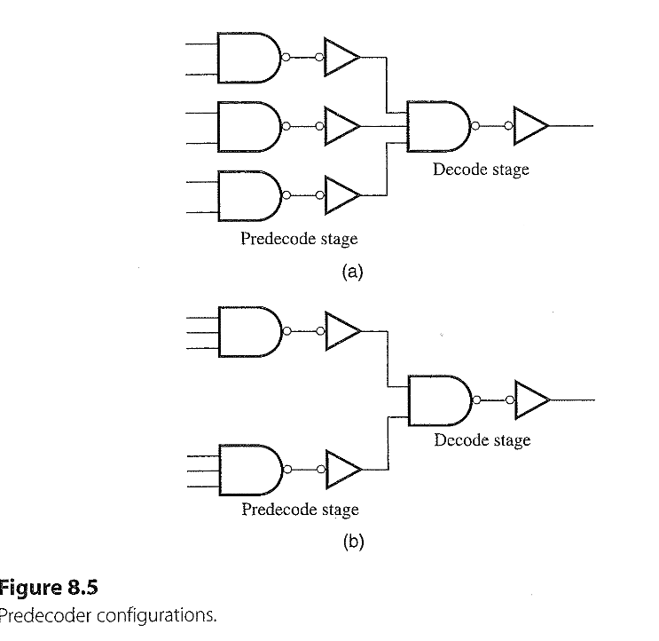
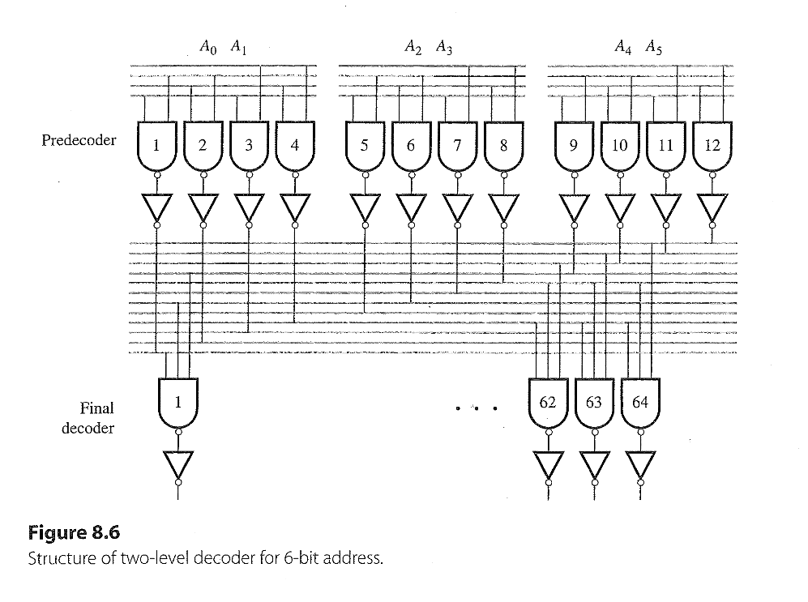
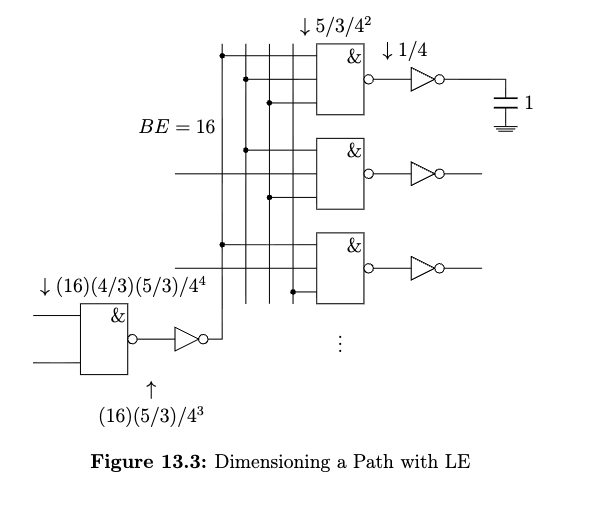
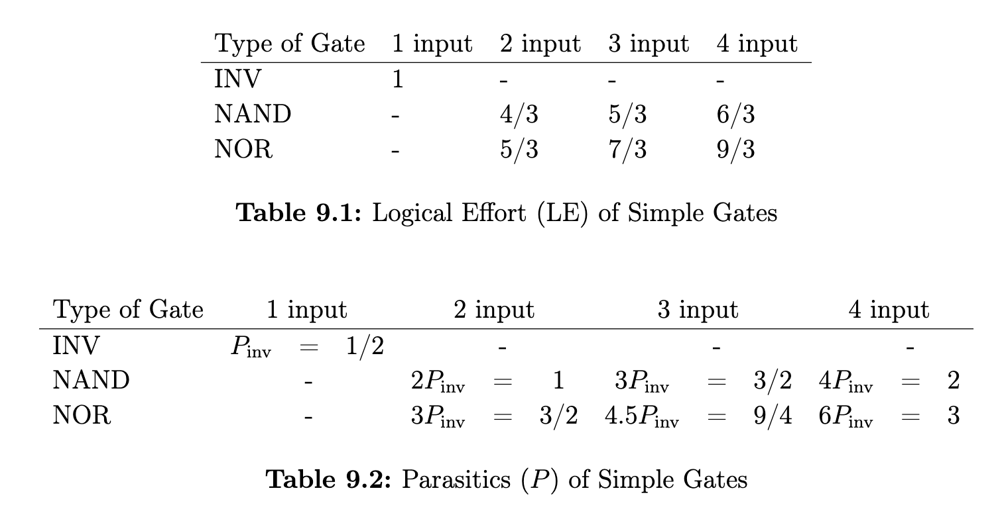

## Task 13.1
### Background 
#### 64 Kb Mem

#### N-Bit Decoder

+ N inputs $\Rightarrow 2^N$ outputs, one of which is activated (1)
+ $2^N \times $ logic gates required, each with n inputs 
---

#### Exp. 2-Bit decoder

+ 2 inputs ($A_1, A_0$) $\Rightarrow 2^2$ output (0001, 0010, 0100, 1000)
+ $2^2 = 4$ AND2/NOR2 gate are required.
---

#### Exp. 6-Bit decoder

+ $2^6 = 64 \times $ AND6/NOR6 gates are needed
  + But too large area or series resistances and delay $\uparrow$
+ Two-stage decoder 
  + predecode stage, 
  + final decode stage 

---

#### Branching Effort 
+ $$\text{BE} = \frac{C_{\text{total}}}{C_{\text{on-path}}}$$
+ One critical path, no branch $\Rightarrow $ BE = 1
+ 2 branches $\Rightarrow $ BE = 2
+ 3 branches $\Rightarrow $ BE = 3
+ n branches $\Rightarrow $ BE = n

+ BE of each predecoder inverter = $$ \frac{3 \text{ inputs} \times 64 \text{ NAND3}}{12 \text{ output nodes}} = 16 $$

--- 

### Solution 

+ For each level, $$C_{\text{in}} = \frac{\text{LE} \cdot \text{BE} \cdot C_{\text{out}}}{SE^{\star}} =  \frac{\text{LE} \cdot \text{BE} \cdot C_{\text{out}}}{4}$$
+ The normalized output cap. $C_{L} = 1$
+ Calculating backwards:
  + $$C_{\text{in, inv1}} = \frac{1 \cdot 1 \cdot 1}{4} = \frac{1}{4}  $$
  + $$C_{\text{in, nand3}} = \frac{5/3 \cdot 1 \cdot \frac{1}{4}}{4} = \frac{5/3}{4^2}$$
  + $$C_{\text{in, inv2}} = \frac{1 \cdot 16 \cdot \frac{5/3}{4^2}}{4} = \frac{16 \cdot 5/3}{4^3}$$
  + $$C_{\text{in, nand2}} = \frac{4/3 \cdot 1 \cdot \frac{16 \cdot 5/3}{4^3}}{4} = \frac{16 \cdot 4/3 \cdot 5/3}{4^4}$$
---

---
## Task 13.2

### Background 

+ Read operation:
  + Initially, $b$ and $\overline{b}$ are precharged to $V_{DD}$
  + Assuming "0" is stored at $q$ and $1$ is stored at $\overline{q}$
  + Wordline ($wl$) is raised to $V_{DD}$ to turn $M_3$ and $M_4$ on
  + The left $C_{\text{bit}}$ slowly discharges until $b = q = 0$
  + The right $C_{\text{bit}}$ remains HIGH so $\overline{b} = \overline{q} = 1$
  + After read operation, $wl$ is returned to 0 and bitlines ($bl$) are precharged back to HIGH.

+ Issues:
  + Firstly, the raised $V_q$ could turn on $M_2$ and bring down $V_{\overline{q}}$
    + To ensure $V_q < V_{TN} \Rightarrow Z_{M_3} \approx 3 \times  Z_{M_4} $ 
  + Secondly, due to very small $I_{\text{cell}}$ and large $C_{\text{bit}}$, the read cycle need to be long enough for discharging process. $\Rightarrow \text{CLK} \uparrow$
    + Approximately, $$I_{\text{cell}} = \frac{C_{\text{bit} \Delta V}}{\Delta \tau}$$
    + $\Delta V$, the difference between $b$ and $\overline{b}$, is attached by a sense amp. to produce full swing LOW or HIGH output.
    + $\Delta \tau$ is the target delay of transition $\Delta V$. 

---

### Solution

+ the operation regions of $M_3$ and $M_1$: $%\text{ saturation and linear}$
+ using the current equations $$I_{\text{lin}, M_1} = I_{\text{sat}, M_3} \\ \frac{W_1}{L_1} \frac{\mu_n C_{ox}}{(1 + \frac{V_q}{E_{CN} L_1})}\Bigl[ (V_{DD} - V_{TN})V_q - \frac{V_q^2}{2} \Bigr] = \frac{W_3 v_{\text{sat}} C_{ox} (V_{DD} - V_q - V_{TN})}{(V_{DD} - V_q - V_{TN}) + E_{CN}L_3}  $$
+ Remove $C_{ox}$, insert $V_q = 0.1 \mathrm{V}$ ($\lambda = 0, \gamma = 0$): $$ \frac{W_1}{0.1 \cdot 10^{-4} \mathrm{cm}} \frac{270 \mathrm{cm^2/Vs}}{(1 + \frac{0.1}{0.6})}\Bigl[ (1.2 - 0.4)0.1 - \frac{0.1^2}{2} \Bigr] = \frac{W_3 \cdot 8 \cdot 10^6 \mathrm{cm/s}(1.2 - 0.1 - 0.4)}{(1.2 - 0.1 - 0.4) + 0.6}  \\ \Rightarrow \frac{W_1}{W_3} \approx 1.7 $$
+ The cell current $I_{\text{cell}}$ flows through $M_3$ and $M_1$: $$I_{\text{cell}} = C_{\text{bit}} \cdot \frac{\Delta V}{\Delta \tau} = 2 \mathrm{pF} \cdot \frac{200 \mathrm{mV}}{2 \mathrm{ns}} = 200 \mathrm{\mu A}$$
+ Calculate the $W_3$: $$\frac{W_3 \cdot 8 \cdot 10^6 \mathrm{cm/s} \cdot 1.6 \mathrm{\mu F / cm^2}(1.2 - 0.1 - 0.4)}{(1.2 - 0.1 - 0.4) + 0.6} = 200 \mathrm{\mu A} \\ \Rightarrow W_3 = 0.4 \mathrm{\mu m}$$
+ Calculate the $W_1$ with the ratio: $W_1 \approx 1.7 W_3 = 0.68 \mathrm{\mu m}$

---

## Task 13.3 

+ 64 K SRAM cells = 256 $\times$ 256 cells 
+ For one single word line: $$C_{\text{wl}} = 256\times(2 C_g W + C_\text{\text{wire}}) \\ = 256\times(2\cdot 2\mathrm{fF/\mu m} \cdot 0.5 \mathrm{\mu m} + 30 \lambda \cdot 0.2 \mathrm{fF/\mu m} \cdot 1 \mathrm{\mu m}/20\lambda) \\ = 689 \mathrm{fF} $$
+ For one single bit line: $$C_{\text{bl}} = 256 \times (2 C_{ol} W + C_\text{\text{wire}}) + 256/2 \times C_{\text{contact}} \\ = 256\times(2\cdot 0.25\mathrm{fF/\mu m} \cdot 0.5 \mathrm{\mu m} + 40 \lambda \cdot 0.2 \mathrm{fF/\mu m} \cdot 1 \mathrm{\mu m}/20\lambda) + 128 \cdot 0.5 \mathrm{fF} \\ = 230 \mathrm{fF}$$