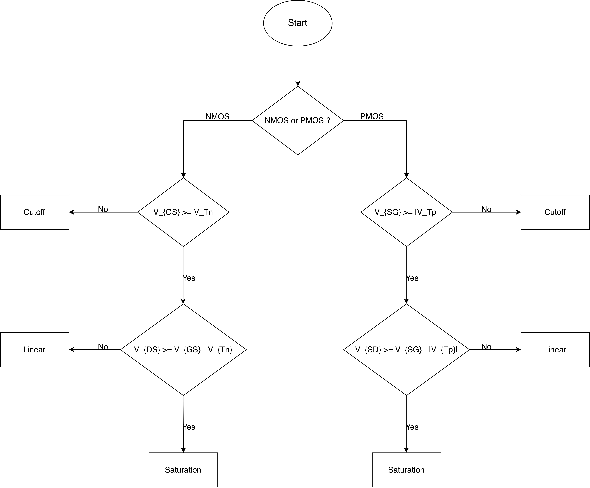
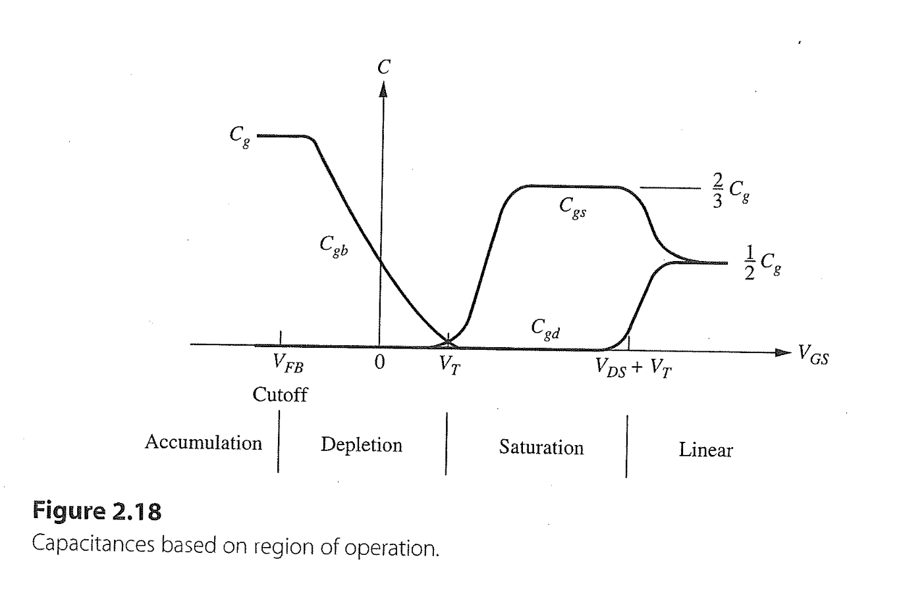

## Task 4.1
### Flowchart of determination MOS region for Long-channel MOSFET

#### Current equations for Long-channel and short-channel MOSFET (page 81, summary)

+  Notation: Mistake $V_{GS} \geq V_T $

### a) 
1. MOS typ? $ \ \text{NMOS}$
2. $V_{GS} =  \ 0.2 \mathrm{V} - 0.0 \mathrm{V} = 0.2 \mathrm{V}$
3. $V_{GS} \geq (V_{Tn} = 0.4 \mathrm{V}) ?  \ \text{No}$
4. Which region? $\ \text{cutoff}$

### b)
1. MOS typ: $ \ \text{NMOS}$
2. $V_{GS} =  \ 1.2 \mathrm{V} - 1.1 \mathrm{V} = 0.1 \mathrm{V}$
3. $V_{GS} \geq (V_{Tn} = 0.4 \mathrm{V}) ? \ \text{No}$
4. Which region? $\ \text{cutoff}$

### c)
1. MOS typ: $ \ \text{NMOS}$
2. $V_{GS} =  \ 1.2 \mathrm{V} - 0.0 \mathrm{V} = 1.2 \mathrm{V}$
3. $V_{GS} \geq (V_{Tn} = 0.4 \mathrm{V}) ? \ \text{Yes}$
4. $V_{DS} = \ 0.2 \mathrm{V} - 0.0 \mathrm{V} = 0.2 \mathrm{V}$
5. $V_{GS} - V_{Tn} = \ 1.2 \mathrm{V} - 0.4 \mathrm{V} = 0.8 \mathrm{V}$
6. $V_{DS} \geq (V_{GS} - V_{Tn}) ? \ \text{No}$
7. Which region? $\ \text{linear}$

### d)
1. MOS typ: $ \ \text{NMOS}$
2. $V_{GS} =  \ 1.0 \mathrm{V} - 0.2 \mathrm{V} = 0.8 \mathrm{V}$
3. $V_{GS} \geq (V_{Tn} = 0.4 \mathrm{V}) ? \ \text{Yes}$
4. $V_{DS} = \  1.2 \mathrm{V} - 0.2 \mathrm{V} = 1.0 \mathrm{V}$
5. $V_{GS} - V_{Tn} = \ 0.8 \mathrm{V} - 0.4 \mathrm{V} = 0.4 \mathrm{V}$
6. $V_{DS} \geq (V_{GS} - V_{Tn}) ? \ \text{Yes}$
7. Which region? $\ \text{saturation}$

### Homework
1. replace all NMOS with PMOS and determine the region ($V_{Tp} = -0.4 \mathrm{V}$)

## Task 4.2
1. On the blackboard

## Task 4.3

1. According to the eq. (2.34) on page 71
2. The thin gate capacitance $C_g = LC_{ox}$, which $C_{ox} = \epsilon_{si}/t_{ox}$ is the oxide capacitance per unit area
$$C_g = 100 \mathrm{nm}  \cdot \frac{4\cdot 8.85 \cdot 10^{-14} \mathrm{As V^{-1}cm^{-1}}}{22 \cdot 10^{-8}\mathrm{cm}} = \ 1.6 \mathrm{fF \mu m^{-1}}$$
3. The gate capacitance $C_G = WL C_{ox} = WC_g$ $$C_G = \ (400 \mathrm{nm} = 0.4 \mathrm{\mu m})  \cdot 1.6 \mathrm{fF \mu m^{-1}} =  0.64 \mathrm{fF}$$

4. The gate capacitance $C_G$ consists of three capacitances:
    + the gate-to-source capacitance $C_{GS}$
    + the gate-to-drain capacitance $C_{GD}$
    + the gate-to-bulk capacitance $C_{GB}$

5. According to the figure 2.18 on page 72, if the MOS transistor in:

    + Cut off region, $\ C_{GS} = 0, C_{GD} = 0, C_{GB} \approx 1/2 \cdot C_G = 0.32 \mathrm{fF}$
    + Linear region, $\ C_{GS} = C_{GD} = 1/2C_{G} = 0.32 \mathrm{fF}, C_{GB} = 0$
    + Saturation region, $\ C_{GS} = 2/3C_{G} = 0.43 \mathrm{fF}, C_{GD} = 0, C_{GB} = 0$

## Task 4.4
### a)
1. the build-in junction potential $\phi_B$ can be calculated using eq.(2.37) on page 74:
$$\phi_B = \frac{kT}{q}\ln\frac{N_AN_D}{n_i^2} = 0.026\mathrm{V} \cdot \ln(\frac{3\cdot10^{17}\mathrm{cm^{-3}}\cdot10^{20}\mathrm{cm^{-3}}}{(1.45\cdot10^{10}\mathrm{cm^{-3}})^2}) = \ 1 \mathrm{V}$$
2. the zero bias junction capacitance $C_{j0}$(or $C_{jb}(V_J)$ or $C_{jb}$) in units of $\frac{fF}{\mu m^2}$ can be calculated using eq. (2.39)
$$C_{j0} = \sqrt{\frac{\epsilon_{si}q}{2\phi_B}\cdot\frac{N_AN_D}{N_A+N_D}}$$
3. Due to $N_D \gg N_A$ so:
$$C_{j0} \approx \sqrt{\frac{\epsilon_{si}qN_A}{2\phi_B}} = \sqrt{\frac{11.7\cdot 8.85\cdot 10^{-14} \mathrm{As V^{-1}cm^{-1}} \cdot 1.6 \cdot 10^{-19}\mathrm{As}\cdot 3\cdot10^{17}\mathrm{cm^{-3}}}{2\cdot 1\mathrm{V}}} \\= \ 1.6 \frac{fF}{\mu m^2}$$

### b)
1. to calculate the the junction capacitance $C_J$ in units of $\mathrm{fF}$ we can use the eq.(2.38) on page 74
$$C_J = \frac{C_{j0}A}{(1 - \frac{V_J}{\phi_B})^m}$$
2. $C_{j0}(C_{jb})$ is the zero bias junction capacitance
3. A is the area of the junction 
4. $\phi_B$ is the build-in junction potential
5. $m$ is the junction grading coefficient, 1/2
6. according to this eq.(2.38) we can get $$C_J(V_J = 0\mathrm{V}) = C_{j0}A, A = \ (Y + x_j)W $$
$$C_J(0\mathrm{V}) = \ 1.6 \mathrm{\frac{fF}{\mu m^2}} \cdot (0.3 \mu m + 0.05 \mathrm{\mu m}) \cdot  0.4 \mathrm{\mu m} \\ 
\ \approx 0.22 \mathrm{fF}$$
7. $$C_J(V_J = -1.2 \mathrm{V}) = \frac{C_{j0}A}{(1 - \frac{-1.2 }{1})^{1/2}} \\  = \ \frac{0.22 \mathrm{fF}}{(1 - \frac{-1.2 }{1})^{1/2}}  \ \\= 0.16 \mathrm{fF}$$

### c)
1. to calculate the parameter $K_{eq}$ we can use the eq.(2.43) on page 77 $$K_{eq} = \frac{-2\Phi_B^{1/2}}{V_2-V_1}[(\Phi_B - V_2)^{1/2} - (\Phi_B - V_1)^{1/2}] \\   =  \ \frac{-2\cdot (1\mathrm{V})^{1/2}}{0\mathrm{V} - (-1.2\mathrm{V})}[(1\mathrm{V} - 0 )^{1/2} - (1\mathrm{V} - (-1.2\mathrm{V}))^{1/2}] \\ \ = 0.8$$

2. Then we can calculate the $C_J$ using eq.(2.44): $$C_J = K_{eq}C_{jb}(Y+x_j)W   \\  =  \ 0.8 \cdot 1.6 \frac{\mathrm{fF}}{\mathrm{\mu m^2}}\cdot(0.3\mu m + 0.05\mu m)\cdot0.4\mu m   \\ \approx 0.18 \mathrm{fF}$$

## Task 4.5
1. To calculate the overlap capacitsnace $C_{ol}$, giving eq. (2.46) on the page 79: $$C_{ol} =  C_{f} + C_{ov}$$
2. eq. (2.47) on the page 79, the fringing capacitance $C_{f}$: $$C_{f} = \frac{2\epsilon_{ox}}{\pi}\ln(1 + \frac{T_{poly}}{t_{ox}}) 
\\  =  \frac{2 \cdot 4 \cdot 8.85\cdot 10^{-14} \mathrm{As V^{-1}cm^{-1}} }{3.14}\ln(1 + 100)
\\  =  0.1 \frac{fF}{\mu m} $$
3. On the page 80 is giving the equation $$C_{ov} = C_{ox} \cdot L_D 
\\  =  1.6 \cdot 10^{-6}\mathrm{\frac{F}{cm^2}} \cdot 10 \cdot 10^{-9} \mathrm{m} 
\\  =  0.16 \mathrm{\frac{fF}{\mu m}} $$

4. $$ C_{ol} =  C_{f} + C_{ov} = \ 0.1 \mathrm{\frac{fF}{\mu m}} + 0.16 \mathrm{\frac{fF}{\mu m}} = 0.26 \mathrm{\frac{fF}{\mu m}}$$
