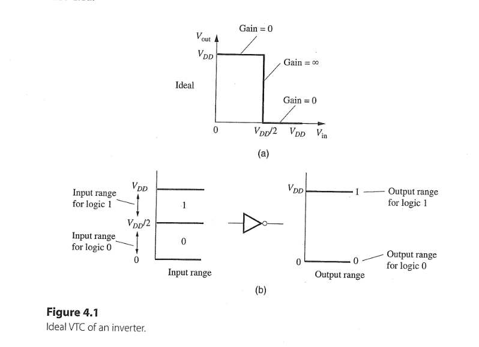
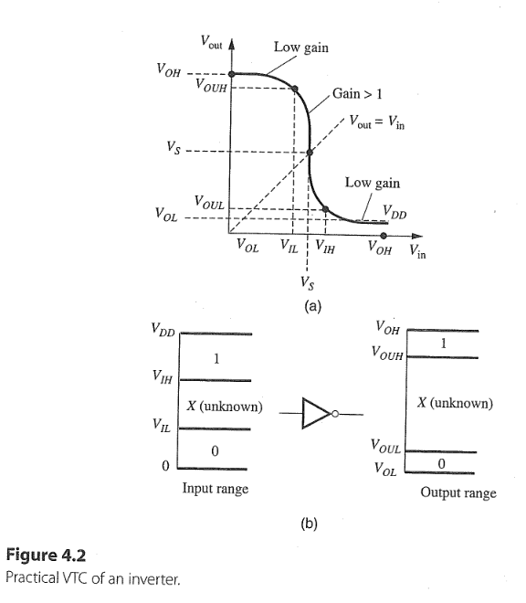
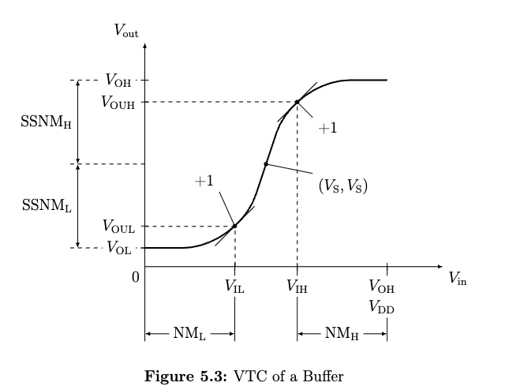
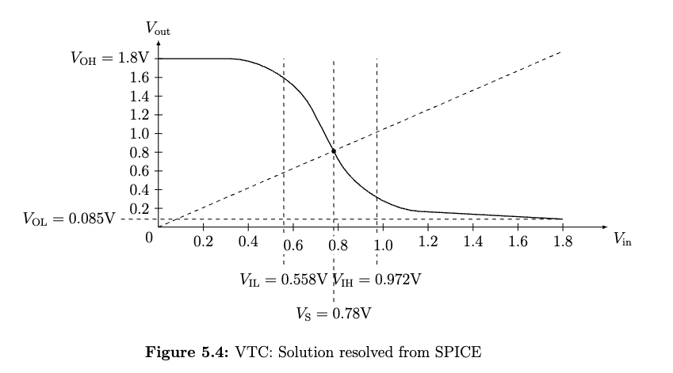
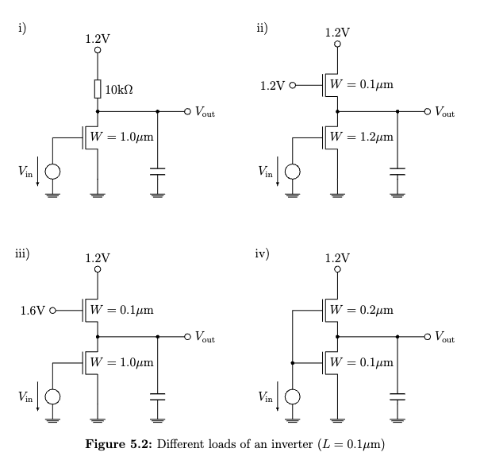

## Task 5.1
1. The ideal VTC of inverter on page 144
 

2. The ideal VTC of buffer is the mirrored image of inverter.
3. But in practice, the practical VTC of inverter should be plotted like the following figure on page 146.

4. So the partical VTC of buffer is like:

5. The slope at point ($\mathrm{V_{IL}}$, $\mathrm{V_{OUL}}$) and point ($\mathrm{V_{IH}}$, $\mathrm{V_{OUH}}$) means unit gain, equals 1 
6. The point ($\mathrm{V_S}$, $\mathrm{V_S}$) means the switching point with swithing threshold voltage $\mathrm{V_S} = (V_{OL} + V_{OH})/2$.
3.  According to eq.(4.2) on page 150 $$\mathrm{SSNM_{H}} = \ \mathrm{V_{OH}} -  \mathrm{V_S} 
\\ \mathrm{SSNM_{L}} =  \ \mathrm{V_{S}} -  \mathrm{V_{OL}}$$
4.  According to eq.(4.3) on page 152 $$\mathrm{NM_{H}} =  \ \mathrm{V_{OH}} -  \mathrm{V_{IH}} 
\\ \mathrm{NM_{L}} =  \ \mathrm{V_{IL}} -  \mathrm{V_{OL}}$$
5.  $\mathrm{V_{OL}} = 0$ only in CMOS structure

## Task 5.2
### a)
1. Derive the formula for $\mathrm{V_{OUL}}$
2. At this point ($\mathrm{V_{IH}}$, $\mathrm{V_{OUL}}$), in which region operates the NMOS in this inverter? $ \ \text{linear}$
3. According the equation of current in linear region:  $$I_{DS} = \frac{W}{L}\frac{\mu_n C_{ox}}{(1 + \frac{V_{DS}}{E_cL})}(V_{GS} - V_T - \frac{V_{DS}}{2})V_{DS}$$
4. So $$\frac{V_{DD}-V_{OUL}}{R_L} = \frac{W}{L}\frac{\mu_n C_{ox}}{(1 + \frac{V_{OUL}}{E_cL})}(V_{IH} - V_T - \frac{V_{OUL}}{2})V_{OUL}$$
5. simplify with $k = \mu_n C_{ox} \frac{W}{L}$ and $V_{OUL}/E_cL \ll1$ $$\frac{V_{DD}-V_{OUL}}{R_L} = k [(V_{IH} - V_T)V_{OUL} - \frac{V_{OUL}^2}{2}] \tag{5.1}$$
6. derivate both sides with $\partial/\partial V_{IH}$ $$-\frac{1}{R_L}\frac{\partial V_{OUL}}{\partial V_{IH}} = k [(V_{IH} - V_T)\frac{\partial V_{OUL}}{\partial V_{IH}} + V_{OUL} - V_{OUL}\frac{\partial V_{OUL}}{\partial V_{IH}}]$$
7. due to $\partial V_{OUL} / \partial V_{IH} = -1$ $$\frac{1}{R_L} = k [V_T - V_{IH} + 2V_{OUL}] \\ \to V_{IH} =   V_T + 2V_{OUL} - \frac{1}{kR_L} \tag{5.2}$$
8. substitute eq.(5.2) to eq. (5.1) $$\frac{V_{DD}-V_{OUL}}{R_L} = k [( V_T + 2V_{OUL} - \frac{1}{kR_L} - V_T)V_{OUL} - \frac{V_{OUL}^2}{2}] \\ = k [\frac{3V_{OUL}^2}{2} - \frac{V_{OUL}}{kR_L}] \\ \to \frac{3k}{2}V_{OUL}^2 = \frac{V_{DD}}{R_L} \tag{5.3}$$
9. solve the quadratic eq.(5.3): $$V_{OUL} =  \pm \sqrt{\frac{2V_{DD}}{3kR_L}} $$
10. Hint: For a quadration equation: $ax^2 + bx + c = 0$, its solutions $$x = \frac{-b \pm \sqrt{b^2 - 4ac}}{2a}$$
11. What should we do if we want a 'better' $V_{OUL}$? 

### b) 
1. At the switching point $V_S$, $V_{out} = V_{in}$ $ V_{DS} > V_{GS} - V_{T}$, in which region? $\ \text{saturation}$
2. According the equation of current in saturation region (channel length modulation effect neglected $\lambda = 0$): $$I_{DS} = Wv_{sat}C_{ox}\frac{(V_{GS}-V_T)^2}{(V_{GS} - V_T) + E_cL}$$
3. So: $$\frac{V_{DD} - V_S}{R_L} = Wv_{sat}C_{ox}\frac{(V_{S}-V_T)^2}{(V_{S} - V_T) + E_cL}$$
4. solve this quadratic equation with $v_{sat} = \mu_n E_c / 2 $ and $k = (W/L)\mu_n C_{ox}$: 
$$V_S = V_T + \frac{V_{DD} - V_T - E_cL}{2 + kR_LE_cL} + \sqrt{\frac{2(V_{DD}-V_T)E_cL}{2 + kR_LE_cL}}$$
5. For long channel devices $E_cL \gg 1$: $$V_S \approx V_T - \frac{1}{kR_L} + \sqrt{\frac{2(V_{DD}-V_T)}{kR_L}}$$

## Task 5.3 
1. calculate the noise margin $NM_H$ and $NM_L$ with eq.(4.3) $$\mathrm{NM_{H}} =  \mathrm{V_{OH}} -  \mathrm{V_{IH}} \\ \mathrm{NM_{L}} =  \mathrm{V_{IL}} -  \mathrm{V_{OL}}$$
2. According to eq. (4.5) on page 155 $V_{OH} = V_{DD} = 1.2 \mathrm{V}$
3. calculate the $V_{OL}$ using the current linear region equation so get approximation (4.6d) on page 156: $$V_{OL} \approx \frac{V_{DD}}{1 + kR_L(V_{DD}- V_T)}
\\ =  \frac{1.2\mathrm{V}}{1 + 430\cdot 10^{-6}\mathrm{AV^{-2}} \cdot 2 \cdot 20\cdot 10^3 \Omega \cdot (1.2 \mathrm{V} - 0.4 \mathrm{V})}
\\ =  0.08 \mathrm{V}$$
4. calculate the $V_{IL}$ using the current saturation region equation so get eq. (4.8b) on page 157: $$V_{IL} = \frac{1}{kR_L} + V_T  
\\ = \ \frac{1}{430\cdot 10^{-6}\mathrm{AV^{-2}} \cdot 2 \cdot 20\cdot 10^3 \Omega} + 0.4 \mathrm{V}
\\ = \ 0.46 \mathrm{V}$$
5. calculate the $V_{IH}$ using the current linear region equation so get equation (4.8f) on page 158: $$V_{IH} = V_T + \sqrt{\frac{8V_{DD}}{3kR_L}} - \frac{1}{kR_L} 
\\ = \ 0.4 \mathrm{V} + \sqrt{\frac{8}{3}\frac{1.2 \mathrm{V}}{430\cdot 10^{-6}\mathrm{AV^{-2}} \cdot 2 \cdot 20\cdot 10^3 \Omega}} - \frac{1}{430\cdot 10^{-6}\mathrm{AV^{-2}} \cdot 2 \cdot 20\cdot 10^3 \Omega}
\\ \approx  \ 0.77 \mathrm{V}$$

6. $$\mathrm{NM_{H}} =  \mathrm{V_{OH}} -  \mathrm{V_{IH}} \\ = \ 1.2 \mathrm{V} -  0.77 \mathrm{V} = 0.43 \mathrm{V} $$
7. $$\mathrm{NM_{L}} =  \mathrm{V_{IL}} -  \mathrm{V_{OL}} \\ = \ 0.46 \mathrm{V} -  0.08 \mathrm{V} = 0.38 \mathrm{V}$$

## Task 5.4
. 
1. $$V_{OH} = V_{DD} = 
\ 1.8 \mathrm{V}$$
2. $$V_{OL} \approx \frac{V_{DD}}{1 + kR_L(V_{DD}- V_T)}  \\ = 
\ \frac{1.8 \mathrm{V} }{1 + 270\cdot2 \mathrm{\mu A / V^2} \cdot 30 \mathrm{k\Omega}(1.8 \mathrm{V} - 0.5 \mathrm{V})} \\ = 
\  0.082 \mathrm{V} $$
3. $$V_{IH} = V_T + \sqrt{\frac{8V_{DD}}{3kR_L}} - \frac{1}{kR_L} \\ = 
\ 0.5 \mathrm{V} + \sqrt{\frac{8\cdot1.8 \mathrm{V}}{3\cdot 270\cdot2 \mathrm{\mu A / V^2} \cdot 30 \mathrm{k\Omega}} } - \frac{1}{270\cdot2 \mathrm{\mu A / V^2} \cdot 30 \mathrm{k\Omega}} \\ = 
\ 0.5 \mathrm{V} + 0.54 \mathrm{V} - 0.06 \mathrm{V}  = 0.98 \mathrm{V} $$
4. $$V_{IL} = \frac{1}{kR_L} + V_T \\= 
\ 0.06 \mathrm{V} + 0.5  \mathrm{V} = 0.56 \mathrm{V} $$
5. $$V_S \approx V_T - \frac{1}{kR_L} + \sqrt{\frac{2(V_{DD}-V_T)}{kR_L}} \\ = 
\ 0.5 \mathrm{V} - 0.06 \mathrm{V} + \sqrt{2(1.88-0.5)\mathrm{V}\cdot0.06}\mathrm{V} 
\\ \approx \ 0.85 \mathrm{V}$$

## Task 5.5
. 
### i)
1. $V_{in} = \mathrm{L}(=0)$, in which region? $ \ \text{cutoff,}$ so NMOS is switched on/off? $ \ \text{switched off} \to \text{no power consumption}$
2. $V_{in} = \mathrm{H}(=V_{DD})$, in which region? $ \ \text{linear}$, so NMOS is switched on/off? $ \ \text{switched on} \to \text{current flow, power consumption}$
3. $V_{in} = \mathrm{H}, V_{out} = V_{OL} = 0 \mathrm{V}? \ \ \text{no, see the eq. (4.6d)}$
4. $V_{in} = \mathrm{L}, V_{out} = V_{OH} = 1.2 \mathrm{V}? \ \ \text{yes}$
5. $\text{function depends on sizing (W/L ratio)?} \ \text{no}$

### ii)
1. $V_{in} = \mathrm{L}(=0)$, $V_{out} = \ 1.2 \mathrm{V} - 0.4 \mathrm{V} = 0.8 \mathrm{V}$, the upper load NMOS is in which region? $\text{linear,}$ the lower NMOS is in which region? $ \ \text{cutoff} \to \text{no current flow, no power consumption}$
2. if $V_{in} = \mathrm{H}(=1.2\mathrm{V})$, the upper load NMOS is switched on, the lower NMOS is also switched on $\Rightarrow \ \text{current flow, power consumption}$
3. $V_{in} = \mathrm{H}, V_{out} = V_{OL} = 0 \mathrm{V}?  \ \ \text{no, see the eq. (4.6d)}$
4. $V_{in} = \mathrm{L}, V_{out} = V_{OH} = 1.2 \mathrm{V}? \ \text{no, 0.8V}$
5. $\text{function depends on W/L ratio?} \\ \ \text{yes}, (W/L)_{\text{lower NMOS}} \gg (W/L)_{\text{upper NMOS}} \Rightarrow \text{Higher pull down capability} \Rightarrow \text{lower(valid)} V_{OL}$

### iii)
1. $V_{in} = \mathrm{L}(=0)$, $V_{out} = 1.6 \mathrm{V} - 0.4 \mathrm{V} = 1.2 \mathrm{V}$, the upper load NMOS is in which region? $\text{linear},$ the lower NMOS is in which region? $\text{cutoff} \Rightarrow \text{no current flow, no power consumption}$
2. if $V_{in} = \mathrm{H}(=1.2\mathrm{V})$, the upper load NMOS is switched on, the lower NMOS is also switched on $\Rightarrow \ \text{current flow, power consumption}$
3. $V_{in} = \mathrm{H}, V_{out} = V_{OL} = 0 \mathrm{V}? \ \text{no, see the eq. (4.6d)}$
4. $V_{in} = \mathrm{L}, V_{out} = V_{OH} = 1.2 \mathrm{V}? \ \text{yes}$
5. $\text{function depends on W/L ratio?} \\ \ \text{yes}, (W/L)_{\text{lower NMOS}} \gg (W/L)_{\text{upper NMOS}} \Rightarrow \text{Higher pull down capability} \Rightarrow \text{lower(valid)} V_{OL}$

### iv)
1. $V_{in} = \mathrm{L}(=0)$, both NMOS are in $  \\text{cutoff}$ region? so $\Rightarrow \ \text{no current flow, no power consumption}$
2. $V_{in} = \mathrm{H}(=V_{DD})$, both NMOS are switched on, so $\Rightarrow \ \text{current flow, power consumption}$
3. $V_{in} = \mathrm{H}, V_{out} = V_{OL} = 0 \mathrm{V}? \ \text{no, see the eq. (4.6d)}$
4. $V_{in} = \mathrm{L}, V_{out} = V_{OH} = 1.2 \mathrm{V}? \ \text{no, 0}$
5. $\text{function depends on W/L ratio?} \\ \ \text{yes, see SPICE simulation}$