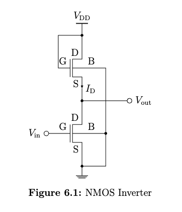
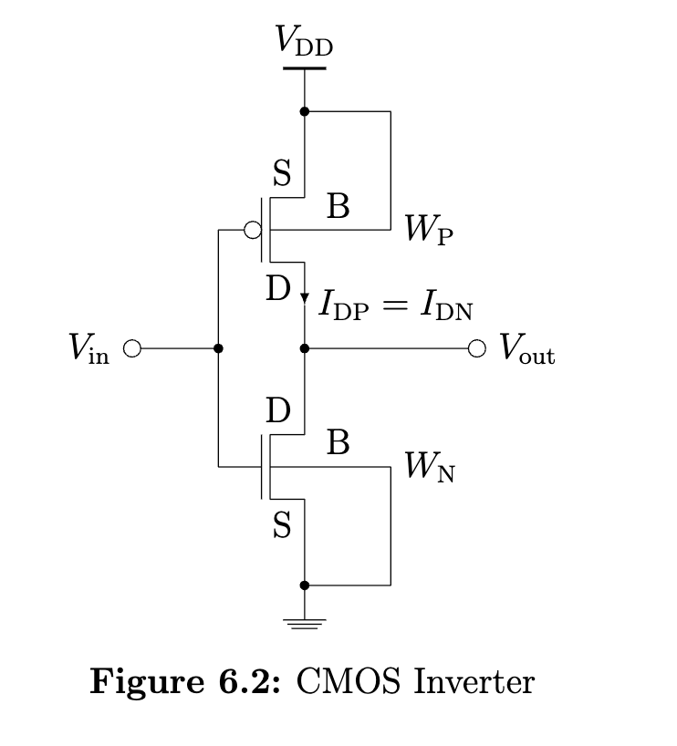
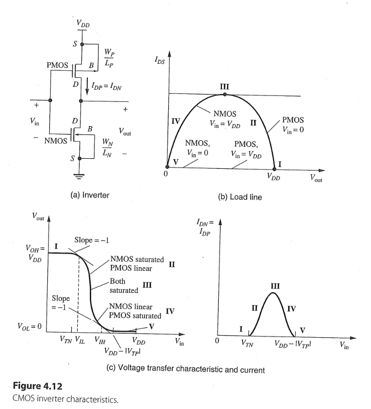
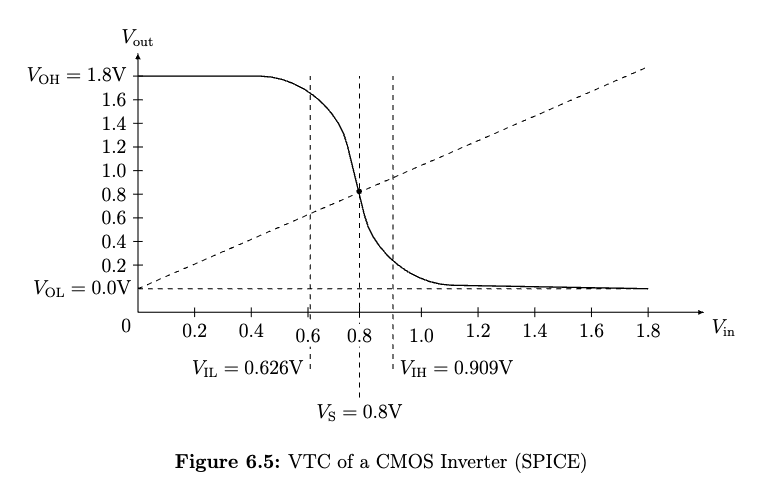
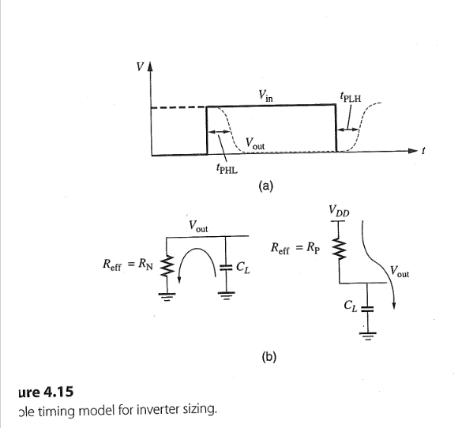
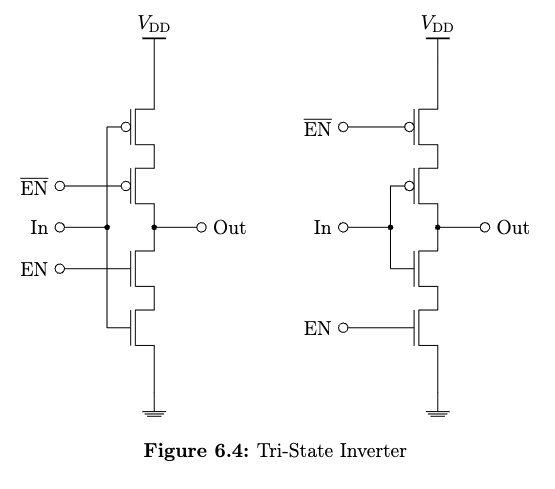

## Task 6.1
     

1. calculate the output voltage high $V_{OH}$
2. The lower NMOS is in cutoff region due to $V_{in} = 0$
3. The upper NMOS is in saturation region due to $V_{DS} = V_{GS}$
4. $$V_{OH} = V_{DD} - V_{DS} \\ = V_{DD} - V_{GS}$$
5. Due to $V_{GS} = V_{Tn}$
6. $$V_{OH} = V_{DD} - V_{Tn}$$
7. According to threshold voltage eq. (2.11): $$V_{Tn} =  V_{T0} + \gamma (\sqrt{V_{SB}+ |2\Phi_F|} - \sqrt{|2\Phi_F|}) \to \\ V_{OH} =  V_{DD} - \Big[V_{T0} + \gamma (\sqrt{V_{SB}+ |2\Phi_F|} - \sqrt{|2\Phi_F|})\Big] \\  =    1.2 \mathrm{V} - 0.4 \mathrm{V} - 0.2\mathrm{V^{1/2}}\sqrt{V_{OH}+ 0.88 \mathrm{V}} + 0.2\mathrm{V^{1/2}}\sqrt{ 0.88 \mathrm{V}} \\ = 0.99 \mathrm{V} - 0.2\mathrm{V^{1/2}}\sqrt{V_{OH} +  0.88 \mathrm{V}}$$
8. Resolve the quadratic equation we get two roots $V_{OH} \approx  0.73 \mathrm{V}$ or $V_{OH} \approx  1.28 \mathrm{V} > V_{DD}$
9. The final result of $V_{OH} =  0.73 \mathrm{V}$
10. Or make iteration starts by $V_{OH} =  1.2 \mathrm{V}$ and ended by $V_{OH} =  0.73 \mathrm{V}$

## Task 6.2
1. If $V_{in} = V_{DD}$ and $V_{out} = V_{OL} = 0.1 \mathrm{V}$, we get the lower NMOS in linear region and the upper NMOS in saturation region. 
2. Using the NMOS current equations for linear and saturation region 
    + in linear $$I_{DS}(\text{lin}) = \frac{W}{L}\frac{\mu_n C_{ox}}{1 + \frac{V_{DS}}{E_cL}}\Bigg[(V_{GS} - V_{Tn})V_{DS} - \frac{V_{DS}^2}{2}\Bigg] \\ =  \frac{W_l}{L}\frac{\mu_n C_{ox}}{1 + \frac{V_{OL}}{E_cL_l}}\Bigg[(V_{DD} - V_{T0})V_{OL} - \frac{V_{OL}^2}{2}\Bigg] \\ =  \frac{W_l}{100 \cdot 10^{-7}\mathrm{cm}} \frac{270 \mathrm{\frac{cm^2}{Vs}}  \cdot C_{ox}}{1 + \frac{0.1 \mathrm{V}}{0.6 \mathrm{V}}}(0.08 \mathrm{V^2} - \frac{0.01}{2} \mathrm{V^2}) \tag{6.1}$$
    + in saturation ($\lambda = 0$) $$I_{DS}(\text{sat}) = Wv_{sat}C_{ox}\frac{(V_{GS} - V_{Tn})^2}{(V_{GS} - V_{Tn}) + E_cL} \\ = \  W_u v_{sat}C_{ox}\frac{\Bigg[(V_{DD} - V_{OL}) - (V_{T0} + \gamma (\sqrt{V_{SB}+ |2\Phi_F|} - \sqrt{|2\Phi_F|}))\Bigg]^2}{\Bigg[(V_{DD} - V_{OL}) - (V_{T0} + \gamma (\sqrt{V_{SB}+ |2\Phi_F|} - \sqrt{|2\Phi_F|}))\Bigg] + E_cL} \\ =  W_u \cdot 8 \cdot 10^6 \mathrm{cm/s} \cdot C_{ox} \frac{(1.1 \mathrm{V} - 0.41 \mathrm{V})^2}{1.1 \mathrm{V} - 0.41 \mathrm{V} + 0.6 \mathrm{V}} \tag{6.2}$$

3. Due to $I_{DS}(\text{lin}) = I_{DS}(\text{sat})$, we get: $$\frac{W_l}{100 \cdot 10^{-7}\mathrm{cm}} \frac{270 \mathrm{\frac{cm^2}{Vs}}}{1 + \frac{0.1 \mathrm{V}}{0.6 \mathrm{V}}}(0.08 \mathrm{V^2} - \frac{0.01}{2} \mathrm{V^2}) = W_u \cdot 8 \cdot 10^6 \mathrm{cm/s} \frac{(1.1 \mathrm{V} - 0.41 \mathrm{V})^2}{1.1 \mathrm{V} - 0.41 \mathrm{V} + 0.6 \mathrm{V}}$$

4. Simplify we get: $$\frac{W_l}{W_u} = 1.7 $$

5. How design this NMOS load inverter with 130 nm technology node ($L = 100 \text{nm}$)?

## Task 6.3
 

1. NMOS in saturation region and PMOS in linear region $\to$ $I_{DP}(\text{lin}) = I_{DN}(\text{sat})$
2. According eq.(4.16) on page 173: $$\frac{W_N}{L_N}\frac{\mu_n C_{ox}}{2}(V_{in} - V_{TN})^2 = \frac{W_P}{L_P}\mu_p C_{ox}(V_{DD} - V_{out}) \Bigg[(V_{DD} - V_{in} - |V_{TP}|) - \frac{(V_{DD} - V_{out})}{2} \Bigg]$$
3. Simplify with $k_N = \frac{W_N}{L_N}\mu_n C_{ox}$, $k_P = \frac{W_P}{L_P} \mu_p C_{ox}$, $V_{in} = V_{IL}$ and $V_{out} = V_{OUH}$ we get: 
$$\frac{k_N}{2 k_P} (V_{IL} - V_{TN})^2 = (V_{DD} - V_{OUH}) \Bigg[(V_{DD}-|V_{TP}|-V_{TN}) - (V_{IL} - V_{TN}) - \frac{V_{DD} - V_{OUH}}{2} \Bigg]$$
4. Substitute with $a = k_N/k_P, x = V_{IL} - V_{TN}, y = V_{DD} - V_{OUH}, z = V_{DD}-|V_{TP}|-V_{TN}$ we get:
$$\frac{a}{2}x^2 = y(z-x - \frac{y}{2}) \to \\ ax^2 = y(2z - 2x - y)  \tag{6.3}$$
5. According eq.(4.17) on page 174: $$V_{IL} = \frac{2V_{OUH} - V_{DD} - |V_{TP}| + (k_N/k_P)(V_{TN})}{1 + (k_N/k_P)}$$
6. Rewrite the above equation: $$V_{IL} - V_{TN} = \frac{(V_{DD} - |V_{TP}| - V_{TN}) - 2(V_{DD} - V_{OUH})}{1 + (k_N/k_P)}$$
7. Simplify : $$x = \frac{z - 2y}{1 + a} \to \\ 2y = z-x(1+a) \to \\ y = \frac{z-x(1+a)}{2} \tag{6.4} $$
8. Replace eq.(6.4) in eq.(6.3):
$$ax^2 = \frac{z-x(1+a)}{2}(2z - 2x - \frac{z-x(1+a)}{2}) \tag{6.5a}$$
9. Rewirte eq. (6.5a): $$2x(3+a)z = 3z^2 - x^2(a^2 + 2a - 3) \tag{6.5b}$$
10. Assume $a = k_N/k_P = 1$, we get: $$8zx = 3z^2 \to x = 3z/8 $$
11. Assume $|V_{TP}| = V_{TN} \to z = V_{DD} - 2 V_{TN}$
 + So we get $$V_{IL} - V_{TN} = \frac{3}{8}(V_{DD} - 2 V_{TN}) \to \\  V_{IL} = \frac{1}{4}(\frac{3}{2}V_{DD} + V_{TN}) \tag{6.6}$$
 + Due to symmetrical VTC of CMOS Inverter: $$V_{IL} + V_{IH} = V_{DD} \to \\  V_{IH} = V_{DD} - V_{IL} =  \frac{1}{4}(\frac{5}{2}V_{DD} - V_{TN}) \tag{6.7}$$
 + Insert $x = 3z/8$ in eq. (6.4) yields $$y = \frac{z}{8} \to \\ V_{OUH} = \frac{7}{8}V_{DD} + \frac{1}{4}V_{TN} \tag{6.8}$$

12. Assume $|V_{TP}| \neq V_{TN} \to z = V_{DD} - |V_{TP}| - V_{TN}$
 + So we get $$V_{IL} - V_{TN} = \frac{3}{8}(V_{DD} - |V_{TP}| - V_{TN}) \to \\  V_{IL} = \frac{1}{8}(3V_{DD} - 3|V_{Tp}| + 5V_{TN}) \tag{6.9}$$
 + Due to unsymmetrical VTC of CMOS Inverter (see figure 4.12 on page 168): $$V_{IL} + V_{IH} = V_{DD} - |V_{TP}| + V_{TN} \to \\  V_{IH} = V_{DD}  - |V_{TP}| + V_{TN} - V_{IL} \\ =  \frac{1}{8}(5V_{DD} - 5|V_{TP}| + 3V_{TN}) \tag{6.10}$$
 + Insert $x = 3z/8$ in eq. (6.4) yields $$y = \frac{z}{8} \to \\ V_{OUH} = \frac{7}{8}V_{DD} + \frac{1}{8}|V_{TP}| + \frac{1}{8}V_{TN}  \tag{6.11}$$
 

## Task 6.4
1. SPICE simulation

 

2. Hand calculation
+ $$V_{OL} =  0\mathrm{V}, V_{OH} =  1.8 \mathrm{V}$$ 
+ Due to $|V_{TP}| = V_{TN}$ using eq.(6.6) $$ V_{IL} = \frac{1}{4}(\frac{3}{2}V_{DD} + V_{TN})  \\ =   \frac{1}{4}(\frac{3}{2}\cdot 1.8  \mathrm{V} + 0.5  \mathrm{V}) =  0.8 \mathrm{V} $$
+ According to eq. (6.7) $$V_{IH} = \frac{1}{4}(\frac{5}{2}V_{DD} - V_{TN})  \\ =   \frac{1}{4}(\frac{5}{2}\cdot 1.8  \mathrm{V} - 0.5  \mathrm{V})=  1 \mathrm{V}$$
+ According to eq. (4.14) on page 170: $$V_S = \frac{V_{DD} - |V_{TP}| + \chi V_{TN}}{1 + \chi}$$
    + Where $\chi$ can be found in eq. (4.15): $$\chi = \sqrt{\frac{\frac{W_N}{E_{CN}L_N}}{\frac{W_P}{E_{CPL_P}}}}  \\ =   \sqrt{\frac{400 \mathrm{nm} \cdot 4.8 \mathrm{V}}{800 \mathrm{nm} \cdot 1.2 \mathrm{V}} } =  1.41$$
    + So $$V_S =  \frac{V_{DD} - |V_{TP}| + \chi V_{TN}}{1 + \chi} \\ =   \frac{1.8 - |-0.5| + 1.41\cdot0.5}{1 + 1.41}\mathrm{V} =  0.83 \mathrm{V}$$

3. Why deviation for $V_{IL}$ and $V_{IH}$?
+ $\text{channel length modulation effect}$
+ $(k_N = \mu_nC_{ox}W_N/L) \approx (2k_P = 2\mu_nC_{ox}W_P/L) \Rightarrow a = k_N/k_P \approx 2$

## Task 6.5
1. According to eq. (4.14)  and eq. (4.15) if $W_P \uparrow \ \Rightarrow \chi \downarrow \ \Rightarrow V_S \uparrow $
2. $$\chi(W_N=100\mathrm{nm}, W_P = 400\mathrm{nm}) =  \sqrt{\frac{100 \cdot 4 E_{CN} }{400 \cdot E_{CN}}} = 1$$
3. $$V_S(\chi = 1) =  \frac{1.2 - |-0.4| + 1\cdot0.4}{1 + 1}\mathrm{V} =  0.6 \mathrm{V}$$
4. $$\chi(W_N=100\mathrm{nm}, W_P = 100\mathrm{nm}) =   \sqrt{\frac{100 \cdot 4 E_{CN} }{100 \cdot E_{CN}}} =   2$$
5. $$V_S(\chi = 2) =  \frac{1.2 - |-0.4| + 2\cdot0.4}{1 + 2}\mathrm{V} =  0.53 \mathrm{V}$$

## Task 6.6 
+ $130 \mathrm{nm}$ technology node $\Rightarrow$ shorted-channel device 
### a) 
1. In Region III and symmetrical VTC: $$ I_{DN}(\text{sat}) = I_{DP}(\text{sat}) \Rightarrow V_{GS} = V_{SG} = V_{DD}/2$$
2. Using the short-channel saturation current equation: $$W_Nv_{sat, n}C_{ox}\frac{(V_{GS}-V_{TN})^2}{(V_{GS} - V_{TN}) + E_{CN}L} = W_Pv_{sat, p}C_{ox}\frac{(V_{SG}- |V_{TP}|)^2}{(V_{SG} - |V_{TP}|) + E_{CP}L}$$
3. Due to $(v_{sat, n} = \mu_n E_{CN} / 2) \approx (v_{sat, p} =  \mu_p E_{CP} /2)$, simplify: $$W_N\frac{(V_{GS}-V_{TN})^2}{(V_{GS} - V_{TN}) + E_{CN}L} = W_P\frac{(V_{SG}- |V_{TP}|)^2}{(V_{SG} - |V_{TP}|) + E_{CP}L}$$ 
4. Due to $V_{TN} = |V_{TP}|$ and $V_{GS} = V_{SG} = V_{DD}/2$: $$\frac{W_P}{W_N} = \frac{(V_{SG} - |V_{TP}|) + E_{CP}L}{(V_{GS} - V_{TN}) + E_{CN}L} \\ =  \frac{(0.6 \mathrm{V}- 0.4 \mathrm{V}) + 2.4 \mathrm{V}}{(0.6 \mathrm{V} - 0.4 \mathrm{V}) + 0.6 \mathrm{V}} =   3.25$$

### b) 
+ Standby mode is a low-power mode where the inverter minimizes power consumpation
1. $V_{in} = V_{GS} = V_{DD} = 1.2 \mathrm{V} \Rightarrow $ linear or saturation
2. For the NMOS: $$(V_{DS} = 0.5 \mathrm{V}) > \Bigg[\frac{(V_{GS} - V_{TN})E_{CN}L}{(V_{GS} - V_{TN}) + E_{CN}L}  = \frac{(1.2 - 0.4)\cdot 0.6}{(1.2 - 0.4) + 0.6} \mathrm{V} = 0.34 \mathrm{V} \Bigg] \\ \Rightarrow \text{Region}:  \text{ saturation}$$
3. For 100% power $I_{DN}$ with $V_{SB} = 0$: $$I_{DN}(100\%) = W_Nv_{sat, n}C_{ox}\frac{(V_{DD}-V_{T0})^2}{(V_{DD} - V_{T0}) + E_{CN}L} \\ =  W_Nv_{sat, n}C_{ox}\frac{(1.2-0.4)^2}{(1.2 - 0.4) + 0.6}\mathrm{V} \\ =  W_Nv_{sat, n}C_{ox} \cdot 0.46 \mathrm{V}$$
4. For 50% power $I_{DN}$ with $V_{SB} \neq 0$: $$\downarrow I_{DN}(50\%) = W_Nv_{sat, n}C_{ox}\frac{(V_{DD}- \uparrow V_{TN})^2}{(V_{DD} - \uparrow V_{TN}) + E_{CN}L}$$
    + where $$\uparrow V_{TN} = V_{T0} + \gamma(\sqrt{\uparrow V_{SB} + 2|\Phi_F|} - \sqrt{2|\Phi_F|}) \\ = V_{T0} + \uparrow \Delta V_T $$
    + So $$I_{DN}(50\%) = W_Nv_{sat, n}C_{ox} \frac{(0.8 - \Delta V_T)^2}{0.8 - \Delta V_T + 0.6} \mathrm{V}$$

5. Assume the ratio $K$: $$K = \frac{I_{DN}(50\%)}{I_{DN}(100\%)} =  \frac{1}{0.46}\frac{(0.8 - \Delta V_T)^2}{0.8 - \Delta V_T + 0.6} = 0.5$$

6. Resolve this quadratic eq. yields : $\Delta V_T = $ $ 0.34 \mathrm{V}$ $  \Rightarrow V_{SB} = 6.08 \mathrm{V}$

## 6.7 
### a) design pseudo-NMOS inverter
1. PMOS is always switched on 
    + If $V_{in} = 0 \mathrm{V} \Rightarrow \text{NMOS off} \Rightarrow V_{out} = V_{OH} = 1.8 \mathrm{V}$
    + If $V_{in} = V_{DD} = 1.8 \mathrm{V} \Rightarrow V_{out} = V_{OL} = 0.065 \mathrm{V} \Rightarrow \text{NMOS in lin, PMOS in sat} $
  
2. Using the shorted channel current equation for linear and saturation region: $$W_Pv_{sat, p}C_{ox}\frac{(V_{DD}- |V_{TP}|)^2}{(V_{DD} - |V_{TP}|) + E_{CP}L} = \frac{W_N}{L}\frac{\mu_n C_{ox}}{(1 + \frac{V_{OL}}{E_{CN}L})}\Bigg[ (V_{DD} - V_{TN})V_{OL} - \frac{V_{OL}^2}{2} \Bigg]$$

3. Resolve the above eq. with parameters of 180 $\text{nm}$ technology node $$\frac{W_N}{W_P} \approx 2.0$$

## 6.8
1. high to low propagation delay $t_{PHL}$ and $t_{PLH}$
 
+ measured at the point  of 50% $V_{in}$ and $V_{out}$
+ to calculate the delay, inverter is modeled with effective on-resistance $R_{eff}$, driving a load capacitance $C_L$
+ for the output falling case, discharging RC circuit, the output response is: $$V_{out}(t) = V_{DD}e^{-t/R_NC_L} \tag{4.22a}$$
+ for the output rising case, charging RC circuit, the output response is: $$V_{out}(t) = V_{DD}(1 - e^{-t/R_PC_L}) \tag{4.22b}$$
+ $$t_{PHL} = t_{PLH} = \tau \approx 0.69 R_{eff}C_L \tag{4.22c}$$
+ minimum area $\downarrow A = \downarrow W \cdot L$: $$\uparrow R_{eff} = \frac{V_{DS}}{I_{D}} \approx \frac{1}{k_n^{'}\frac{\downarrow W}{L}(V_{GS} - V_{TN})} $$
+ According to eq.(4.22c) on page 182 $$\tau_{max} \approx 0.70 R_{eff}C_L = 50 \cdot 10^{-12} \text{s} \Rightarrow R_{eff} = 1.4 \mathrm{k\Omega} $$

2. More equations on page 182: 
+ $$R_{eqn} = 12.5 \mathrm{k\Omega}/\square  \tag{4.23a}$$ 
+ $$R_{eqp} = 30 \mathrm{k\Omega}/\square  \tag{4.23b}$$ 
+ $$R_{N} = R_{eqn} \cdot \frac{L_N}{W_N} \tag{4.24a}$$
+ $$R_{P} = R_{eqp} \cdot \frac{L_P}{W_P} \tag{4.24b}$$

3. According to eq. (4.23a) and (4.24a): $$R_{N} = R_{eff} = (12.5 \mathrm{k\Omega}) \cdot \frac{L_N}{W_N} = 1.4 \mathrm{k\Omega} \Rightarrow \frac{W_N}{L_N} = 8.92$$
4. According to eq. (4.23b) and (4.24b): $$R_{P} = R_{eff} = (30 \mathrm{k\Omega}) \cdot \frac{L_N}{W_N} = 1.4 \mathrm{k\Omega} \Rightarrow \frac{W_P}{L_P} = 21$$
5. Sizing of CMOS inverter with 130 nm technology node ($L = 100 \text{nm}$): $$\frac{W_N}{L_N} = \frac{892 \text{nm}}{100 \text{nm}}, \space  \frac{W_P}{L_P} = \frac{2100 \text{nm}}{100 \text{nm}}$$
6. Sizing of pseudo inverter:
+ The NMOS is identical with the CMOS inverter since same time requirements
+ As $V_{in} = V_{DD} \Rightarrow V_{out} = V_{OL} = 0.1 \mathrm{V} \Rightarrow \text{NMOS: linear region}$
+ $I_{DP}(sat) = I_{DN}(lin)$: $$\frac{W_Pv_{sat}C_{ox}(V_{DD} - |V_{TP}|)^2}{(V_{DD} - |V_{TP}|) + E_{CP}L_P} = \frac{W_N}{L_N}\frac{\mu_n C_{ox}}{(1+\frac{V_{OL}}{E_{CN}L_N})}\Bigg[(V_{DD} - V_{TN})V_{OL} - \frac{V_{OL}^2}{2} \Bigg] \tag{4.21}$$
+ Resolve eq.(4.21) yields $W_P = 963 \text{nm}$
+ Sizing of pseudo inverter with 130 nm technology node ($L = 100 \text{nm}$): $$\frac{W_N}{L_N} = \frac{892 \text{nm}}{100 \text{nm}}, \space  \frac{W_P}{L_P} = \frac{963 \text{nm}}{100 \text{nm}}$$
+ CMOS vs. pseudo-Inv.
  + Althrough $W_P/L_P$ in pseudo $<$ $W_P/L_P$ in CMOS, In pseudo-Inv. the $t_{PLH} > 100 \text{ps}$.
  + More power consumption in pseudo than in CMOS at logical one input

## Task 6.9
 

 

+ Z stands for high-impedance state (high-Z state), this inverter can not control the output voltage if EN(enable signal = 0), others driver (inverter with EN = 1) can set the output value.
+ Which one is better in terms of propagation delay?
  + $ \text{right one}, \downarrow R_{eff} \Rightarrow \downarrow T_{d}$