## Task 7.1
1. CMOS NOR2 and NAND2 on page 197
  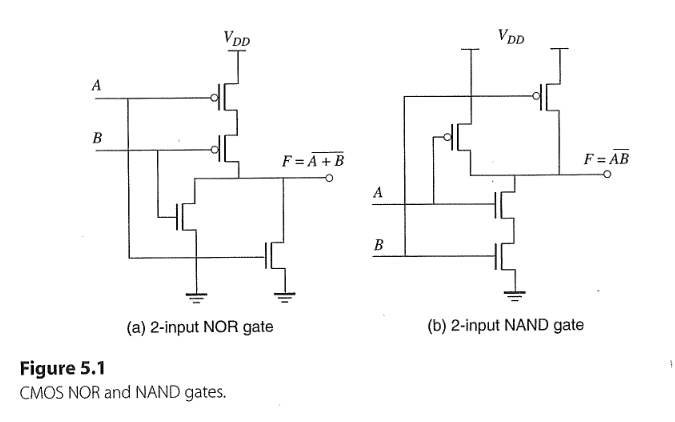  
  + NOR2 truth table: 
    | A | B | F   |
    |:-:|:-:|:---:|
    | 0 | 0 |  1  |
    | 0 | 1 |  0  |
    | 1 | 0 |  0  |
    | 1 | 1 |  0  |
  + NAND2 truth table: 
    | A | B | F   |
    |:-:|:-:|:---:|
    | 0 | 0 |  1  |
    | 0 | 1 |  1  |
    | 1 | 0 |  1  |
    | 1 | 1 |  0  |

  + Rules of thumb:
    + For NOR-n: n-PMOSs are connected in $ \text{series}$, n-NMOSs are connected in $ \text{parallel}$
    + For NAND-n: n-PMOSs are connected in $ \text{parallel}$, n-NMOSs are connected in $ \text{series}$

1. CMOS Gate Sizing 
  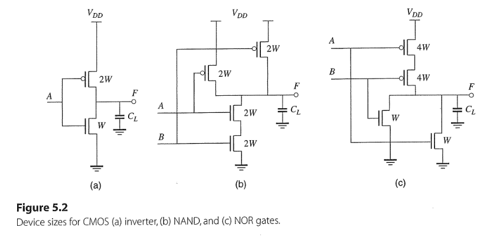  
  + For Inverter: $W_P/W_N = 2/1$ to ensure $t_{PLH} = t_{PHL}$
  + To achieve the same delay/(width ratio) as well as the inverter:
    + For NAND2: 
      + Both pull-up PMOSs have $2W$ under input combinations that one is on and other is off (worse case)
      + Both pull-down NMOSs have $2W$ (doubled) to ensure total resistance($R_{on}$) doesn't changed: $$R_{on}\downarrow = \frac{V_{DS}}{I_{D}} = \frac{V_{DS}}{\frac{1}{2}\mu_n C_{ox}\frac{W\uparrow}{L}(V_{GS} - V_{TN})^2}$$
  
    + For NOR2:
      + Both pull-up PMOSs have $4W$ (doubled) to keep same resistance since they are in series connected.
      + Both pull-down NMOSs have $1W$ same size as the NMOSs in inverter to ensure same delay.
  + Rules of thumb:
      + N times MOSs in parallel: $$W = W_1 = W_2 = W_3 = \cdots = W_{N}$$
      + N times MOSs in series: $$W = W_1 + W_2 + W_3 + \cdots + W_{N} \\ = N \times W_N$$
   
      

1. CMOS NAND3 and NOR3
   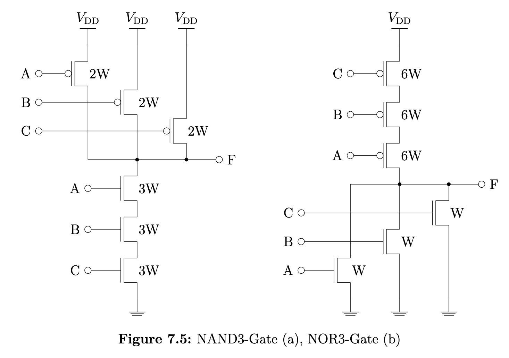  

## Task 7.2 
+ Multiple level implementations of AND8
1. 2-level AND8: $$O = I_1 \cdot I_2 \cdot I_3 \cdot I_4 \cdot I_5 \cdot I_6 \cdot I_7 \cdot I_8 \\ = \overline{\overline{I_1 \cdot I_2 \cdot I_3 \cdot I_4 \cdot I_5 \cdot I_6 \cdot I_7 \cdot I_8}}$$
   + $=:$ 1-NAND8 to 1-INV
   + Area ($W\times L$): $$W_{total} = (8\cdot 8W + 8\cdot 2W) + (2W + W) = 83 W$$
2. 2-level AND8: $$O = \overline{\overline{(I_1 \cdot I_2 \cdot I_3 \cdot I_4) \cdot (I_5 \cdot I_6 \cdot I_7 \cdot I_8)}} \\ = \overline{(\overline{I_1 \cdot I_2 \cdot I_3 \cdot I_4}) + (\overline{I_5 \cdot I_6 \cdot I_7 \cdot I_8})}$$
   + $=:$ 2-NAND4 to 1-NOR2
   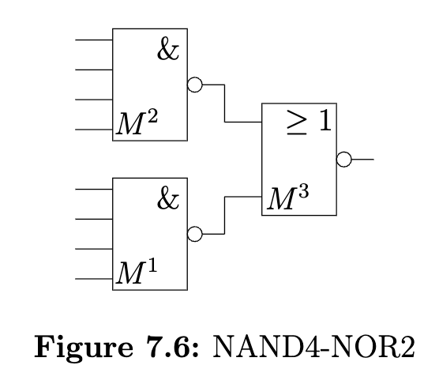  
   + Area ($W\times L$): $$W_{total} = 2(4 \cdot 4 W + 4\cdot 2W) + (2\cdot 4W + 2\cdot 1W) = 58 W$$ 

3. 4-level AND8: $$O = \overline{(\overline{I_1 \cdot I_2 \cdot I_3 \cdot I_4}) + (\overline{I_5 \cdot I_6 \cdot I_7 \cdot I_8})} \\ = \overline{((\overline{I_1 \cdot I_2}) + (\overline{I_3 \cdot I_4})) + ((\overline{I_5 \cdot I_6}) + (\overline{I_7 \cdot I_8}))} \\ = \overline{\overline{(\overline{(\overline{I_1 \cdot I_2}) + (\overline{I_3 \cdot I_4})})} + \overline{(\overline{(\overline{I_5 \cdot I_6}) + (\overline{I_7 \cdot I_8})})}}$$
   + $=:$ 4-NAND2 to 2-NOR2 to 2-INV to 1-NOR2
    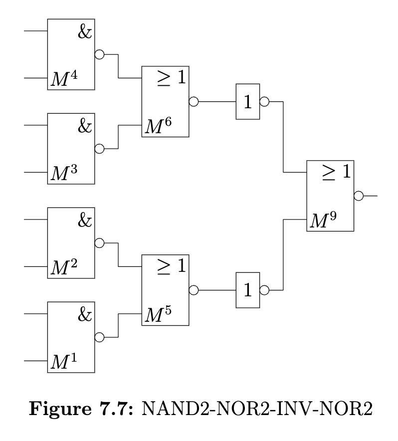 
   + Area ($W\times L$): $$W_{total} = 4(2\cdot2W + 2\cdot2W) + 2(2\cdot4W + 2\cdot1W) + 2(2W + 1W) + (2\cdot4W + 2\cdot1W) = 68 W$$ 

## Task 7.3 
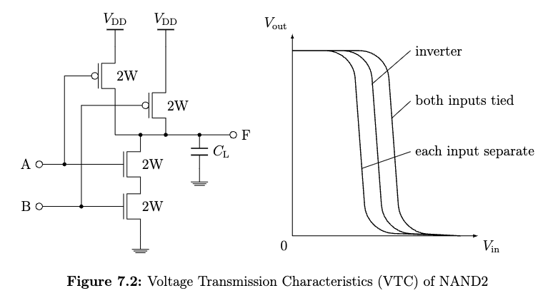  

+ According to eq.(5.1) on page 201, if all MOSFETs that connected in series simultaneously on : $$\frac{1}{W_{eq}} = \frac{1}{W_{1}} + \frac{1}{W_{2}} + \frac{1}{W_{3}} + \cdots \tag{5.1}$$

+ According to eq.(5.2), if all MOSFETs that connected in parallel simultaneously on : $$W_{eq} = W_{1} + W_{2} + W_{3} + \cdots \tag{5.2}$$

### a)
#### i) one is connected to $V_{DD}$, other transitions from 0 to $V_{DD}$
+ $W_{eq, P} = 2W, W_{eq, N} = 2W$
+ According to eq. (4.14) on page 170: $$V_S = \frac{V_{DD} - |V_{TP}| + \chi V_{TN}}{1 + \chi}$$
    + Where $\chi$ can be found in eq. (4.15): $$\chi = \sqrt{\frac{\frac{W_N}{E_{CN}L_N}}{\frac{W_P}{E_{CPL_P}}}}  \\ =  \sqrt{\frac{2W \cdot 4.8 \mathrm{V}}{2W  \cdot 1.2 \mathrm{V}} } = 2$$
    + So $$V_S =  \frac{V_{DD} - |V_{TP}| + \chi V_{TN}}{1 + \chi} \\ =   \frac{1.8 - |-0.5| + 2\cdot0.5}{1 + 2}\mathrm{V} =  0.77 \mathrm{V}$$

#### ii) both inputs are connected to each other
+ $W_{eq, P} = 4W, W_{eq, N} = W$
+ According to eq. (4.14) on page 170: $$V_S = \frac{V_{DD} - |V_{TP}| + \chi V_{TN}}{1 + \chi}$$
    + Where $\chi$ can be found in eq. (4.15): $$\chi = \sqrt{\frac{\frac{W_N}{E_{CN}L_N}}{\frac{W_P}{E_{CPL_P}}}}  \\ =  \sqrt{\frac{W \cdot 4.8 \mathrm{V}}{4W \cdot 1.2 \mathrm{V}} } = 1$$
    + So $$V_S =  \frac{V_{DD} - |V_{TP}| + \chi V_{TN}}{1 + \chi} \\ =   \frac{1.8 - |-0.5| + 1\cdot0.5}{1 + 1}\mathrm{V} =  0.9 \mathrm{V}$$

### b)
+ comparing with SPICE simulation
  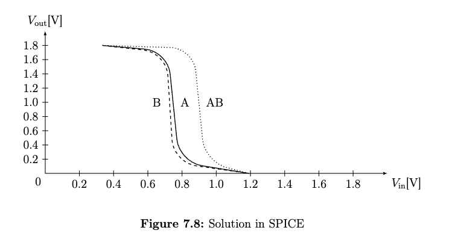
  + Transition at A, $V_S = 0.745 \mathrm{V}$
  + Transition at B, $V_S = 0.721 \mathrm{V}$
  + Transition at AB (simultaneusly) $V_S \approx 0.9 \mathrm{V}$
  
+ Transition at A have slightly higher values than transition at B, why?
  + $\text{Body effect during switching}, V_{SB} \neq 0$

## Task 7.4 
1. $F = \overline{AB + CD}$
2. For CMOS: 
   + DNF: $$\overline{PD}(A, B, C, D) = AB + CD$$
   + CNF: $$PU(A, B, C, D) = \overline{AB + CD} = (\overline{AB})(\overline{CD}) = (\overline{A} + \overline{B})(\overline{C} + \overline{D}) $$

3. 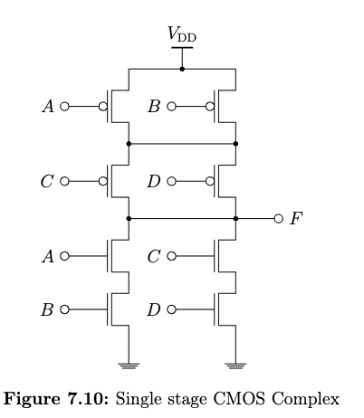
4. 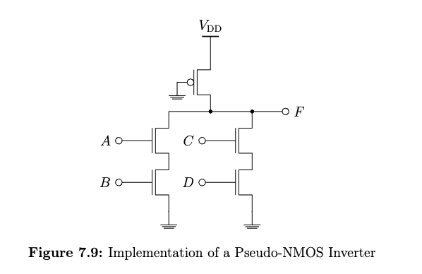
5. Rules of thumb, for CMOS circuit
   + If the n-complex circuit $\overline{PD}$ is connected in parallel (DNF), the p-complex circuit $PU$ is connected in series (CNF)
   + Vice versa.

## Task 7.5
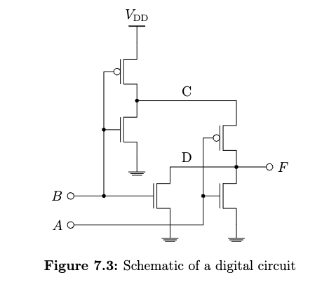

1. Determine the truth table 
+ the input signals: $A, B$
+ the intermediate signals: $C, D$
+ the output signal: $F$
    | A | B | C | D | F |
    |:-:|:-:|:-:|:-:|:-:|
    | 0 | 0 | 1 | Z | 1 |
    | 0 | 1 | 0 | 0 | 0 |
    | 1 | 0 | 1 | Z | 0 |
    | 1 | 1 | 0 | 0 | 0 |
+ $F = \overline{A} \cdot \overline{B} $

## Task 7.6
1. Schematic of NOR RS-Latch

2. The delay from $R$ to $\overline{Q}$ or from $S$ to $Q$ is $400 \text{ps}$ 
   + The delay from $R$ to $Q$ or from $S$ to $\overline{Q}$  is $200 \text{ps}$ 
   + $$t_{PHL} = t_{PLH} = \tau \approx 0.69 R_{eff}C_L \tag{4.22c} \\ \Rightarrow R_{eff} = \frac{t_{PHL}}{0.7 C_L} = \frac{200 \mathrm{ps}}{0.7 \cdot 100 \mathrm{fF}}  =  \frac{20}{7} \mathrm{k\Omega} $$
   + $$R_{eqn} = 12.5 \mathrm{k\Omega}/\square  \tag{4.23a}$$ 
   + $$R_{N} = R_{eff} = R_{eqn} \cdot \frac{L_N}{W_N} \tag{4.24a} \\ \Rightarrow \frac{W_N}{L_N} = \frac{R_{eqn}}{R_{eff}} = \frac{12.5 \cdot 7}{20}  \approx   4.4$$

3. If set $W_N = 440 \mathrm{nm}$ for NMOS, set $W_P =  4\cdot 440 \mathrm{nm} = 1.76 \mathrm{\mu m}$

## Task 7.7
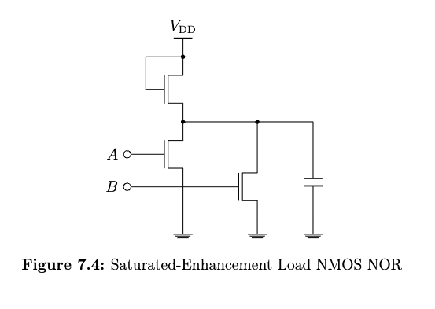

1. Calculate $V_{OH}$ for the output to logical 1
   + $V_{OH} = V_{DD} - V_{TN, u}(V_{SB}) \\ =  V_{DD} - \Big[V_{T0} + \gamma (\sqrt{V_{SB}+ |2\Phi_F|} - \sqrt{|2\Phi_F|})\Big] \\  =    1.2 \mathrm{V} - 0.4 \mathrm{V} - 0.2\mathrm{V^{1/2}}\sqrt{V_{OH}+ 0.88 \mathrm{V}} + 0.2\mathrm{V^{1/2}}\sqrt{ 0.88 \mathrm{V}} \\ = 0.99 \mathrm{V} - 0.2\mathrm{V^{1/2}}\sqrt{V_{OH} +  0.88 \mathrm{V}}$
   + make iteration starts by $V_{OH} =  1.2 \mathrm{V}$ and ended by $V_{OH} =  0.73 \mathrm{V}$
   + $$V_{TN, u}(V_{SB} = V_{OH}) = 0.4\mathrm{V} + 0.2\mathrm{V^{1/2}} (\sqrt{0.73 \mathrm{V} + 0.88 \mathrm{V} } - \sqrt{0.88 \mathrm{V}}) \\ \approx 0.47 \mathrm{V}$$

2. Calculate $V_{OL}, I_{DC}, P_{DC}$ for the output to logical 0 (worse case)
   + worse case has lower pull down capability $\Rightarrow A = 1, B = 0$, or $A = 0, B = 1$
   + upper NMOS in saturation region and lower NMOSs in linear region $\to$ $I_{DC}(\text{lin}) = I_{DC}(\text{sat})$
   + According current equations on page 81: $$ \frac{W_l}{L}\frac{\mu_n C_{ox}}{(1 + \frac{V_{OL}}{E_cL})}(V_{DD} - V_{TN, l} - \frac{V_{OL}}{2})V_{OL} = W_u v_{sat} C_{ox} \frac{(V_{DD} - V_{OL} - V_{TN, u})^2}{(V_{DD} - V_{OL} - V_{TN, u}) + E_cL}$$
   + simplify with $v_{sat} = \mu_n E_c / 2 $: $$ \frac{W_l}{L}\frac{1}{(1 + \frac{V_{OL}}{E_cL})}(V_{DD} - V_{TN, l} - \frac{V_{OL}}{2})V_{OL} = W_u \frac{E_c}{2}\frac{(V_{DD} - V_{OL} - V_{TN, u})^2}{(V_{DD} - V_{OL} - V_{TN, u}) + E_cL}$$
   + simplify with $W_l = W_u, \ 2\lambda/2\lambda$  $$ \frac{1}{L}\frac{1}{(1 + \frac{V_{OL}}{E_cL})}(V_{DD} - V_{TN, l} - \frac{V_{OL}}{2})V_{OL} = \frac{E_c}{2}\frac{(V_{DD} - V_{OL} - V_{TN, u})^2}{(V_{DD} - V_{OL} - V_{TN, u}) + E_cL}$$
   + insert the values: $$ \frac{1}{100 \cdot 10^{-7}\mathrm{cm}}\frac{1}{(1 + \frac{V_{OL}}{0.6 \mathrm{V}})}(1.2 \mathrm{V} - 0.4 \mathrm{V} - \frac{V_{OL}}{2})V_{OL} = \frac{6 \cdot 10^4 \mathrm{V/cm}}{2}\frac{( 1.2 \mathrm{V} - V_{OL} - 0.47 \mathrm{V})^2}{(1.2 \mathrm{V} - V_{OL} - 0.47 \mathrm{V}) + 0.6 \mathrm{V}}$$
   + resolve the above eq. we get $V_{OL} \approx 0.165 \mathrm{V}$

3. Caculate $I_{DC}$
   + $$I_{DC} = W_u v_{sat} C_{ox} \frac{(V_{DD} - V_{OL} - V_{TN, u})^2}{(V_{DD} - V_{OL} - V_{TN, u}) + E_cL} \\ = (100 \cdot 10^{-7}\mathrm{cm})( 8 \cdot 10^6 \mathrm{cm/s})(1.6 \cdot 10^{-6}\mathrm{F/cm^2})\frac{( 1.2 \mathrm{V} - 0.46 \mathrm{V} - 0.47 \mathrm{V})^2}{( 1.2 \mathrm{V} - 0.46 \mathrm{V} - 0.47 \mathrm{V}) +  0.6 \mathrm{V}} \\ =  36 \mathrm{\mu A} $$

4. Calculate $P_{DC}$
   + $$P_{DC} = I_{DC} \cdot V_{DD} = 36 \mathrm{\mu A} \cdot 1.2 \mathrm{V} = 43.2 \mathrm{\mu W}$$