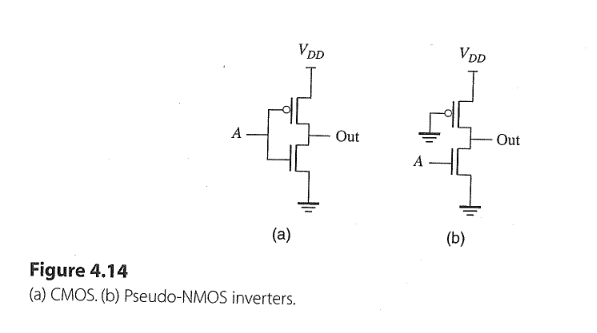
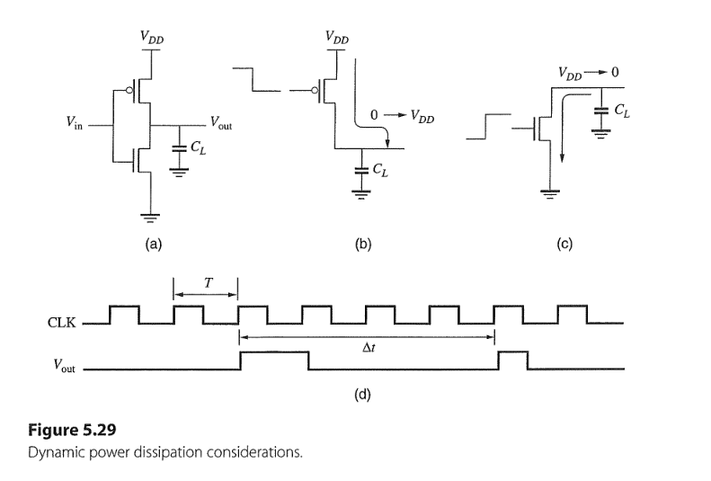
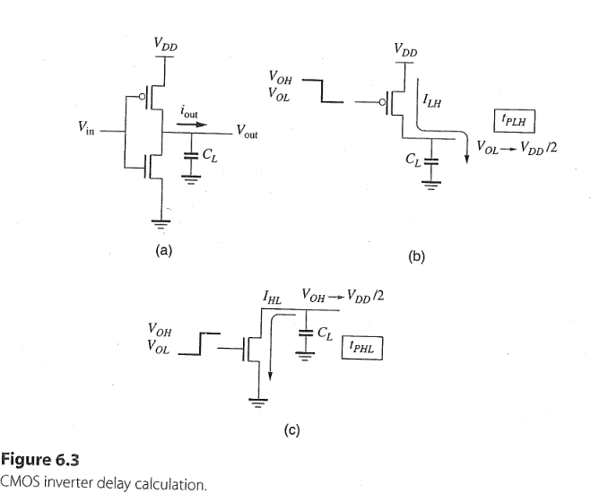
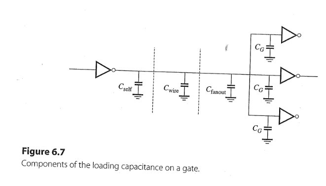
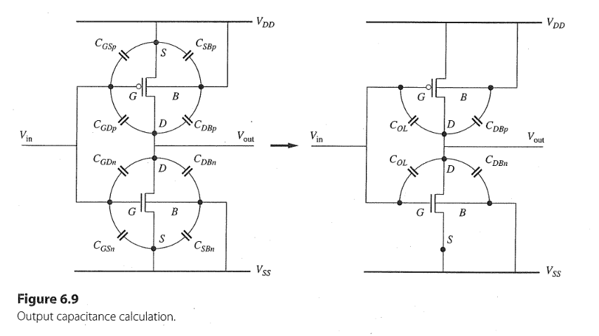
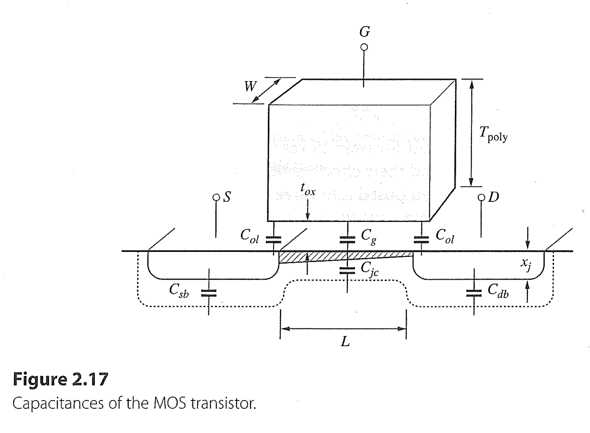
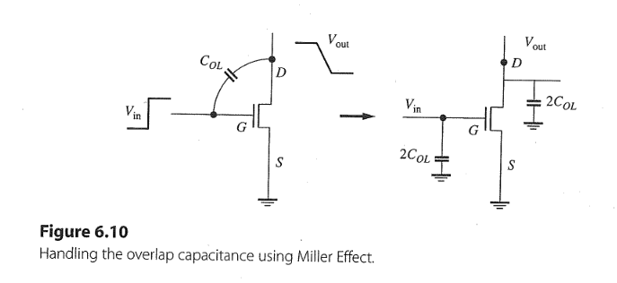
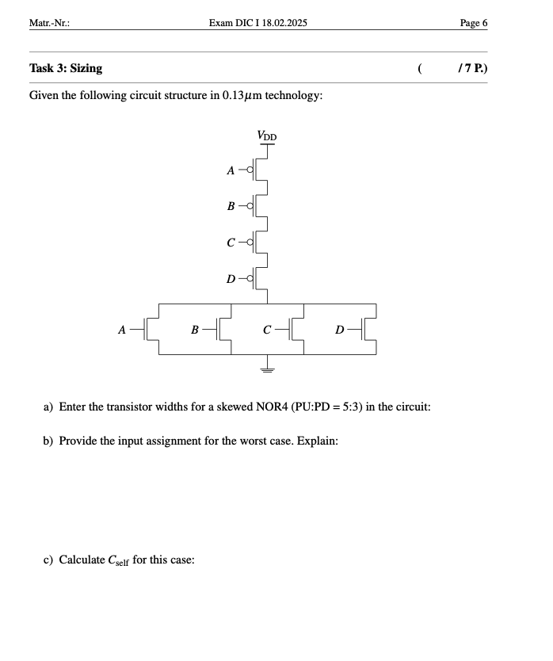

## Task 8.1 
  

1. output logical zero: $\Rightarrow \text{PMOS in saturation region, NMOS in linear region}$
2. using linear current equation for shorted-channel MOSFET: $$I_{DC} = \frac{W_N}{L_N}\frac{\mu_nC_{ox}}{(1 + \frac{V_{DS}}{E_{CN}L})}(V_{GS} - V_{TN} - \frac{V_{DS}}{2})V_{DS} \\ = 9 \frac{270 \mathrm{cm^2/Vs} \cdot 1.6 \cdot 10^{-6}\mathrm{F/cm^2}}{(1 + \frac{0.1 \mathrm{V}}{0.6 \mathrm{V}})}(1.2 \mathrm{V} - 0.4 \mathrm{V} - \frac{0.1 \mathrm{V}}{2})0.1 \mathrm{V} \\ =  250 \mu A$$
3. power consumption: $$P = I_{DC} \cdot V_{DD} =  250 \mu A \cdot 1.2 \mathrm{V} = 300 \mu W$$

## Task 8.2 
+ Calculating dynamic(switching) power: $$P_{\text{switching}} = I_{\text{D, avg}} V_{DD}$$

 

1. capacitance charging and discharging process: $$I_{\text{D, avg}} = C \frac{\partial V}{\partial t} = C_L \frac{\Delta V_{\text{swing}}}{\Delta t} = C_L V_{DD}f_{\text{avg}} \tag{5.8}$$
2. Substitute eq.(5.8) in the power eq. $$P_{\text{switching}} = I_{\text{D, avg}} V_{DD} =C_L V^2_{DD}f_{\text{avg}}  \tag{5.9}$$
3. According to eq.(5.10) on page 229: $$P_{\text{switching}} = \alpha C_L V^2_{DD}f_{\text{clk}} \tag{5.10}$$
   + $$\alpha = \frac{\# \text{toggles} / 2}{\# \text{clock cycles}}$$
4. Power and delay tradeoff:
   + $\downarrow P \Rightarrow \downarrow f_{clk} \Rightarrow \uparrow t_p$
   + Metric: power-delay product (PDP): $$PDP = P_{\text{avg}}t_p \tag{5.19}$$
     + Assuming $t_{\text{clk}} = 1/f_{\text{clk}} = 2 t_p $: $$PDP =\alpha CV^2_{DD}f_{\text{clk}} \frac{1}{2f_{\text{clk}}} = \alpha\frac{CV^2_{DD}}{2} \tag{5.20}$$
     + PDP depends on only with $\alpha$, C and $V_{DD}$
   + Metric: energy-delay product (EDP): $$EDP = PDP \cdot t_p  = P_{avg} \cdot t_p^2\tag{5.21}$$

### i)
+ for single gate: $$P_{\text{single}} = \alpha C_L V^2_{DD}f_{\text{clk}} \\ = 0.1 ( 20 \cdot 10^{-15} \mathrm{F})(1.8 \mathrm{V})^2(500 \cdot 10^6 \mathrm{Hz}) \\ =  3.24 \mathrm{\mu W} $$
+ for 10M gates: $$P_{\text{total}} = 10 \cdot 10^6  \cdot P_{\text{single}} \\ =  32.4 \mathrm{W} $$

### ii)
+ for single gate: $$P_{\text{single}} = \alpha C_L V^2_{DD}f_{\text{clk}} \\ = 0.05 ( 10 \cdot 10^{-15} \mathrm{F})(1.2 \mathrm{V})^2(1 \cdot 10^9 \mathrm{Hz}) \\ =  0.72 \mathrm{\mu W} $$
+ for 10M gates: $$P_{\text{total}} = 50 \cdot 10^6  \cdot P_{\text{single}} \\ =  36 \mathrm{W} $$

4. The switching power consumption of this two chips are approximately equal, so which is better and why?
   + $\text{compare the EDP, which is smaller, which is better}$
   + i) $$ EDP = P\cdot t_p^2 = 32.4 \mathrm{W} \cdot (\frac{1}{2\cdot 500 \cdot 10^6 \mathrm{Hz}})^2 = 32.4 \cdot 10^{-18} \mathrm{Js}$$
   + ii) $$ EDP = P\cdot t_p^2 = 36 \mathrm{W} \cdot (\frac{1}{2\cdot 1 \cdot 10^9 \mathrm{Hz}})^2 = 9 \cdot 10^{-18} \mathrm{Js}$$

## Task 8.3
1. In RC charging circuit, the total energy transitions dissipated heat energy at the resistor and stored energy at the capacitor 
2. The stored energy at the capacitor: $$E_C(t) = \int_0^t dE_C(t) \\ = \int_0^t P_C(t)dt  \\ = \int_0^t i_C(t)V_C(t)dt \\ = \int_0^t C\cdot \frac{d V_{out}(t)}{d t}V_{out}(t)dt \\ = C \int_0^{V_{out}} V_{out}dV_{out}$$
   + At timepoint $t = \infty \rightarrow V_{out} = V_{DD}$: $$E_C(V_{out} = V_{DD}) =  \frac{1}{2}CV_{DD}^2$$

3. The dissipated heat energy at the resistor: $$E_R(t) = \int_0^t dE_R(t) \\ = \int_0^t P_R(t)dt  \\ = \int_0^t i_C(t)V_R(t)dt \\ = \int_0^t C\cdot \frac{d V_{out}(t)}{d t}(V_{DD} - V_{out}(t))dt \\ = C \int_0^{V_{out}}(V_{DD} - V_{out})dV_{out}$$
   + At timepoint $t = \infty \rightarrow V_{out} = V_{DD}$: $$E_R(V_{out} = V_{DD}) =  \frac{1}{2}CV_{DD}^2$$

## Task 8.4 
+ For CMOS inverter, calcualte its $R_{eqn}$ and $R_{eqp}$ 

 

+ According to capacitance eq. $$I = C_L \frac{dV}{dt} \rightarrow \Delta t = C_L \frac{\Delta V}{I_{DC}}$$
+ low-to-high propagation delay $t_{PLH}$: $$t_{PLH} = \frac{C_L(V_{DD}/2)}{I_{LH}} \tag{6.1}$$
+ high-to-low propagation delay $t_{PHL}$: $$t_{PHL} = \frac{C_L(V_{DD}/2)}{I_{HL}} \tag{6.2}$$
+ the average propagation delay $t_p$: $$t_p = \frac{t_{PLH} + t_{PHL}}{2} \tag{6.3}$$

+ determine the operation region of NMOS to get $I_{HL}$: $$V_{GS} = V_{DD} > V_{TN}, \\ (V_{DS} = V_{DD}/2) > (V_{D,sat} = \frac{(V_{GS} - V_{TN})E_{CN}L}{(V_{GS} - V_{TN}) + E_{CN}L} \\ = \frac{(1.2 - 0.4)0.6}{(1.2 - 0.4) + 0.6} \mathrm{V}= 0.34 \mathrm{V}) \\ \Rightarrow \text{saturation region}  $$
  + $$t_{PHL} = \frac{C_L(V_{DD}/2)}{(I_{D,sat})_N} \tag{6.4a}$$
  + According to $t_{PHL} = \tau \approx 0.7 R_{eqn}C_L$: $$R_{eqn} = \frac{V_{DD}/2}{0.7(I_{D,sat})_N} \tag{6.4b}$$

+ determine the operation region of PMOS to get $I_{LH}$: $$V_{SG} = V_{DD} > |V_{TP}|, \\ (V_{SD} = V_{DD}/2) = (V_{D,sat} = \frac{(V_{SG} - |V_{TP}|)E_{CP}L}{(V_{SG} - |V_{TP}|) + E_{CP}L} \\ = \frac{(1.2 - 0.4)2.4}{(1.2 - 0.4) + 2.4} \mathrm{V} = 0.6 \mathrm{V}) \\ \Rightarrow \text{saturation region}  $$
  + $$t_{PLH} = \frac{C_L(V_{DD}/2)}{(I_{D,sat})_P} \tag{6.5a}$$
  + According to $t_{PLH} = \tau \approx 0.7 R_{eqp}C_L$: $$R_{eqp} = \frac{V_{DD}/2}{0.7(I_{D,sat})_P} \tag{6.5b}$$

#### Solution
1. current eq. in saturation: $$(I_{D,sat})_N = W_N v_{sat}C_{ox}\frac{(V_{DD}-V_{TN})^2}{(V_{DD}-V_{TN}) + E_{CN}L_N} \\ = (0.1 \cdot 10^{-4} \mathrm{cm})(8 \cdot 10^6 \mathrm{cm/s})(1.6 \cdot 10^{-6} \mathrm{F/cm^2} )\frac{(1.2 \mathrm{V} - 0.4 \mathrm{V})^2}{(1.2 \mathrm{V} - 0.4 \mathrm{V}) + 0.6 \mathrm{V}} \\ \approx  60\mu A$$
2. According to eq. (6.4b): $$R_{eqn} = \frac{V_{DD}/2}{0.7(I_{D,sat})_N} \\ =   \frac{1.2 \mathrm{V}/2}{0.7(60\mu A)} = 14.5 \mathrm{k\Omega} $$

3. current eq. in saturation: $$(I_{D,sat})_P = W_P v_{sat}C_{ox}\frac{(V_{DD}-|V_{TP}|)^2}{(V_{DD}-|V_{TP}|) + E_{CP}L_P} \\ = (0.1 \cdot 10^{-4} \mathrm{cm})(8 \cdot 10^6 \mathrm{cm/s})(1.6 \cdot 10^{-6} \mathrm{F/cm^2} )\frac{(1.2 \mathrm{V} - 0.4 \mathrm{V})^2}{(1.2 \mathrm{V} - 0.4 \mathrm{V}) + 2.4 \mathrm{V}} \\ \approx  25\mu A$$
4. According to eq. (6.5b): $$R_{eqn} = \frac{V_{DD}/2}{0.7(I_{D,sat})_N} \\ =  \frac{1.2 \mathrm{V}/2}{0.7(25\mu A)} = 33.5 \mathrm{k\Omega} $$
5. Due to channel length modulation $\lambda > 0 \Rightarrow I_{DS} \uparrow$, the hand calculation of $R_{eqn}$ and $R_{eqp}$ are larger than SPICE simulation of $R_{eqn} = 12.5 \mathrm{k \Omega / \square}$ and $R_{eqp} = 30 \mathrm{k \Omega / \square}$

## Task 8.5 

+ the load capacitance consists of three components: $$C_{\text{load}} = C_{\text{self}} + C_{\text{wire}} + C_{\text{fanout}} \tag{6.7}$$

+ $C_{\text{self}}$ is the sum of the capacitances to the output $V_{\text{out}}$, intrinsic output cap.
+ $C_{GSn}, C_{GSp}, C_{SBn}, C_{SBp}$ can be eliminated, because they are not connected to output.
+ 
+ For $t_{PHL}$ and $t_{PLH}$ transition, the transistors are in saturation or cut off region.
   + 

   + $C_{gd} \approx 0$ in both regions, can be neglected
   + only 2 overlap cap. $C_{OL}$ and junction cap. $C_{DBn}$ and $C_{DBp}$ are left
  
 
   + 
   + 
   + the toal $C_{\text{self}}$: $$C_{\text{self}} = C_{DBn} + C_{DBp} + 2C_{OL} + 2C_{OL} \\ = C_{jn}W_n + C_{jp}W_p + 2C_{ol}(W_n + W_p) \\ = C_{\text{eff}}(W_n + W_p) \tag{6.10}$$
     + $C_{\text{eff}} = C_j + 2 C_{ol} \approx 0.5 \mathrm{fF/\mu m} + 2 (0.25 \mathrm{fF/\mu m}) = 1  \mathrm{fF/\mu m}$
#### Solution
1. Worst case $\Rightarrow (A, B, C): [111] \to [110], F: 0 \to 1$
2. What is the best case?
   + $(A, B, C): [111] \to [011], F: 0 \to 1$
3. the input cap. $C_G$: 
   + 
   + $$C_G = C_{Gn} + 2 C_{OL} + C_{Gp} + 2 C_{OL} \\ = C_{ox}LW_n + 2 C_{ol}W_n + C_{ox}LW_p + 2 C_{ol}W_p \\ = (C_{ox}L + 2 C_{ol})(W_N + W_P) \\ =  C_g(W_N + W_P) \tag{6.8}$$
   + the gate cap. $$C_g = C_{ox}L + 2 C_{ol} = 1.6 \mathrm{fF/\mu m} + 2 (0.25 \mathrm{fF/\mu m}) \approx 2 \mathrm{fF/\mu m} \tag{6.9}$$
   + the $W_N = 3W, W_P = 2W \Rightarrow$ $$C_G = C_g \cdot (5\mathrm{W})$$

4. rough calculation of output intrinsic cap. $C_{\text{self}}$, According to eq. (6.10): $$C_{\text{self}} = C_{\text{eff}}(W_n + W_p)$$
   + $C_{\text{eff}} = C_j + 2 C_{ol} \approx 0.5 \mathrm{fF/\mu m} + 2 (0.25 \mathrm{fF/\mu m}) = 1  \mathrm{fF/\mu m}$
   + $W_n = 3\mathrm{W} + 3\mathrm{W} + 3\mathrm{W} = 9 \mathrm{W}$
   + $W_p = 2\mathrm{W} + 2\mathrm{W} = 4 \mathrm{W} $ due to 2 PMOS shared S/D area 
   + $$C_{\text{self}} = C_{\text{eff}} \cdot 13 \mathrm{W}$$

5. refined calculation of output intrinsic cap. $C_{\text{self}}$
   + we define $$\alpha = \frac{V_{DD}- V_{TN}}{V_{DD}} $$
   + for worst case: 
     + $$W_p \cdot C_{\text{eff}} = 2\mathrm{W} \cdot (2\cdot C_j + 2\cdot C_{ol} + C_{ol}(1 + 1)) = 4 \mathrm{W} \cdot C_{\text{eff}}$$
     + $$W_n \cdot C_{\text{eff}} = (C_j + C_{ol}) \cdot (3\mathrm{W}) \\ + (C_j + 3\cdot C_{ol}) \cdot (3\mathrm{W})\alpha \\ + (C_{ol})\cdot(3W)(1 + \alpha) \\ =  C_{\text{eff}} \cdot (9 \mathrm{W} - 6 \mathrm{W} (V_{TN}/V_{DD})) $$
     + $$C_{\text{self}} = W_n \cdot C_{\text{eff}} + W_p \cdot C_{\text{eff}} = C_{\text{eff}} \cdot (13 \mathrm{W} - 6 \mathrm{W} (V_{TN}/V_{DD}))$$

## Task 8.6 
1. $$C_{\text{load}} = C_{\text{self}} + C_{\text{wire}} + C_{\text{fanout}} \tag{6.7}$$
2. $$C_{\text{self}} = C_{\text{eff}}(W_n + W_p) = (1 \mathrm{fF/\mu m})(8 \lambda  + 4 \lambda) = 12 \lambda \mathrm{fF/\mu m} $$
3. $$C_{\text{fanout}} = \sum C_G = n \cdot C_G = n \cdot C_g (W_N + W_P) \\ = 4(2 \mathrm{fF/\mu m})(8 \lambda  + 4 \lambda) = 96\lambda \mathrm{fF/\mu m}$$
4. $$C_{\text{wire}} = C_{\text{int}} \cdot (\text{wirelength}) \tag{6.12}$$
5. $$C_{\text{load}} =12 \lambda \mathrm{fF/\mu m} + 0 + 96\lambda \mathrm{fF/\mu m} = 108 \lambda \mathrm{fF/\mu m}  $$
6. for 180 nm technology, $L = 2\lambda = 200 \ \text{nm} \Rightarrow:$ $$C_{\text{load}} = 10.8 \mathrm{fF} $$

## Task 8.7 
+ RS-FF exam irrelevant 
+ Lets do a task from past exam for CMOS sizing and cap. computation

a) $W_{eq, PU} : W_{eq, PD} = 5 : 3 \Rightarrow  W_{PD} = 3 \text{W}, W_{PU} = 20 \text{W}$
b) worst-case: $ (A, B, C, D): [0000] \to [1000], F: 1 \to 0$ 
$\text{A is the transistor that furthest away from the output.}$
$\text{ If only A switches, this maximizes the capacitances }( C_{eff} ) \text{ that need to be charged/discharged.}$
$\text{ thus, highest popagation delay.}$

c) $$C_{self} =  C_{eff} \cdot W_n + C_{eff} \cdot W_p \\ = 66.75\text{W} \mathrm{fF / \mu m}$$
$$C_{eff} \cdot W_n = (2 \cdot C_{ol} + 2 \cdot C_j + 3 \cdot C_{ol}) \cdot (3\text{W}) \\ = (2 \cdot 0.25 \mathrm{fF / \mu m} + 2 \cdot 0.5 \mathrm{fF / \mu m}  + 3 \cdot 0.25 \mathrm{fF / \mu m} ) \cdot (3\text{W}) \\ = 6.75 \text{W}  \ \mathrm{fF / \mu m} $$
$$C_{eff} \cdot W_p =  \Big[(C_{ol} + C_j) + (5 \cdot C_{ol} + 3 \cdot C_{j})\alpha  + C_{ol}(1 + \alpha)\Big]\cdot 20\text{W} \\ = \Big[( 0.25 \mathrm{fF / \mu m} +  0.5 \mathrm{fF / \mu m}) + (5 \cdot  0.25 \mathrm{fF / \mu m} + 3 \cdot  0.5 \mathrm{fF / \mu m})\frac{2}{3}  +  0.25 \mathrm{fF / \mu m}(1 + \frac{2}{3})\Big]\cdot 20\text{W} \\ = 60\text{W} \mathrm{fF / \mu m}$$
