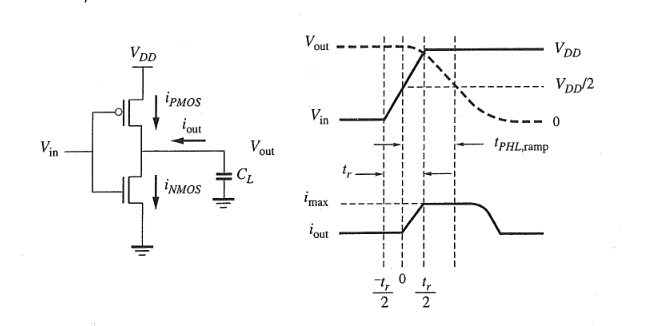
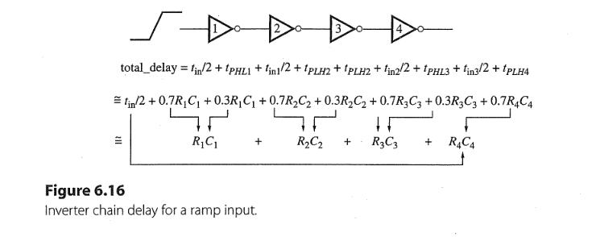
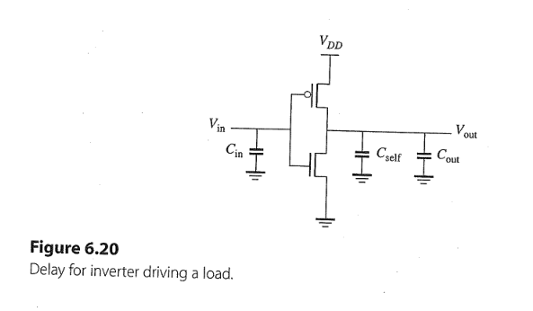
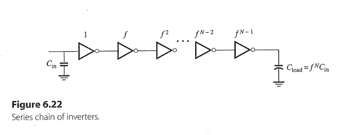
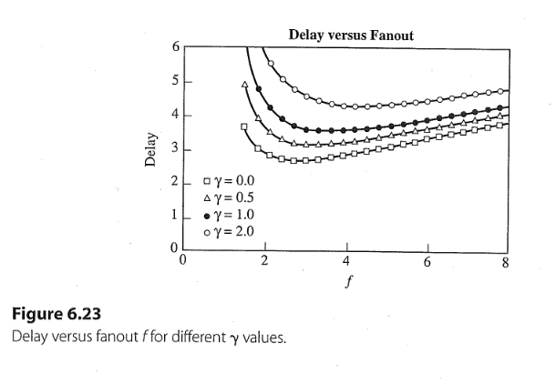
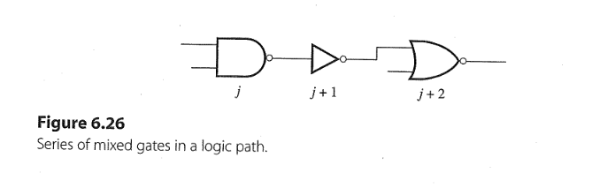

## Task 9.1 
+ In reality, inputs behave more like a ramp not step $\Rightarrow \uparrow t_{\text{PHL}}$
 
+ According to the example 6.5 on pages 270-272: $$t_{\text{r}} \approx 2t_{\text{PLH,step}}, \\ t_{\text{PHL, ramp}} = \frac{t_{\text{r}}}{4} + t_{\text{PHL, step}} \\\Rightarrow t_{\text{PHL, ramp}} \approx \frac{t_{\text{PHL, step}}}{2} + t_{\text{PHL, step}} \\ = \frac{0.7 R_{\text{eff}}C_{L}}{2} + 0.7 R_{\text{eff}}C_{L} \approx R_{\text{eff}}C_L$$
+ For example, for an inverter chain with ramp input, its total propagation delay: 
 
$$\tau_{\text{delay}} = \sum_i R_i C_i \tag{6.15}$$
---

### Solution
### a) FO4 of an inverter
1. Fanout 4 $\Rightarrow$ An inverter drives 4 identical inverters. 
2. According to the task 8.6 $$C_{\text{load}} = C_{\text{self}} + C_{\text{wire}} + C_{\text{fanout}} \\ = 1.2\mathrm{fF} + 0 + 9.6\mathrm{fF} \\ = 10.8\mathrm{fF}$$
3. For ramp input: 
   + $$t_{\text{PHL, ramp}} = R_{\text{eff}}C_{\text{load}} = R_{eqn}\frac{L_n}{W_n}C_{\text{load}} \\ = 12.5 \mathrm{k\Omega}\frac{2\lambda}{4\lambda}10.8\mathrm{fF} \approx 68 \mathrm{ps}$$
   + $$t_{\text{PLH, ramp}} = R_{\text{eff}}C_{\text{load}} = R_{eqp}\frac{L_p}{W_p}C_{\text{load}} \\ = 30 \mathrm{k\Omega}\frac{2\lambda}{8\lambda}10.8\mathrm{fF} \approx 81 \mathrm{ps}$$
   + $$t_{\text{p, avg}} = \frac{t_{\text{PHL, ramp}} + t_{\text{PLH, ramp}}}{2} = 74.5 \mathrm{ps}$$

4. For step input: 
   + $$t_{\text{PHL, step}} = 0.7 t_{\text{PHL, ramp}}$$
   + $$t_{\text{PLH, step}} = 0.7 t_{\text{PLH, ramp}}$$
   + $$t_{\text{p, avg}} = \frac{t_{\text{PHL, step}} + t_{\text{PLH, step}}}{2}$$

### b) FO1 of 4 inverters
1. The chain of 4 identical inverters
2. For ramp input: 
    + $$\tau_{\text{delay}} = \sum_{i=1}^4 R_i C_i$$
    + For one inverter: $$C_{\text{load}} = C_{\text{self}} + C_{\text{wire}} + C_{\text{fanout}} \\ = 1.2\mathrm{fF} + 0 + 2.4\mathrm{fF} \\ = 3.6\mathrm{fF}$$
    + $$t_{\text{PHL, ramp}} = R_{\text{eff}}C_{\text{load}} = R_{eqn}\frac{L_n}{W_n}C_{\text{load}} \\ = 12.5 \mathrm{k\Omega}\frac{2\lambda}{4\lambda}3.6\mathrm{fF} = 22.5 \mathrm{ps}$$
    + $$t_{\text{PLH, ramp}} = R_{\text{eff}}C_{\text{load}} = R_{eqp}\frac{L_p}{W_p}C_{\text{load}} \\ = 30 \mathrm{k\Omega}\frac{2\lambda}{8\lambda}3.6\mathrm{fF} = 27 \mathrm{ps}$$
    + The total propagation delay: $$\tau_{\text{delay}} = 4 \frac{t_{\text{PHL, ramp}} + t_{\text{PLH, ramp}}}{2} = 99 \text{ps}$$

3. For step input: $$\tau_{\text{delay}} = 0.7 \times 99 \text{ps}$$
---

## Task 9.2 
 

+ the intrinsic time constant $\tau_{\text{inv}}$, the product of the input capacitance $C_{\text{in}}$ and the effective resistance $R_{\text{eff}}$: $$\tau_{\text{inv}} = R_{\text{eff}} \cdot C_{\text{in}} \\ =R_{eqn}\frac{L_n}{W_n} \cdot C_g(W_n + W_p) \\ = R_{eqn}\frac{L_n}{W_n} \cdot C_g(W_n + 2W_n) \\ = 3 R_{eqn}C_gL_n \tag{6.18}$$
+ the propagation delay $t_{\text{delay}}$ of a single inverter ($C_{\text{wire}} = 0$): $$t_{\text{delay}} = R_{\text{eff}}[C_{\text{out}} + C_{\text{self}}] \\ = R_{\text{eff}}C_{\text{in}}\Bigg[\frac{C_{\text{out}}}{C_\text{in}} + \frac{C_{\text{self}}}{C_\text{in}} \Bigg] \\ = \tau_{\text{inv}}\Big[\frac{C_{\text{out}}}{C_\text{in}} + \gamma_{\text{inv}} \Big] \tag{6.19}$$
+ $\gamma_{\text{inv}}$ is the ratio of self-capacitance $C_{\text{self}}$ to input capacitance $C_{\text{in}}$: $$\gamma_{\text{inv}} = \frac{C_{\text{self}}}{C_{\text{in}}} \tag{6.20}$$
---
#### Solution
1. $$\tau_{\text{inv}} = 3 R_{eqn}C_gL_n \\ = 3 \cdot 12.5 \mathrm{k \Omega} \cdot 2 \mathrm{fF/\mu m}\cdot 0.1 \mathrm{\mu m} \\ = 7.5 \mathrm{ps}$$
2. $$\gamma_{\text{inv}} = \frac{C_{\text{self}}}{C_{\text{in}}} = \frac{C_{\text{eff}}(W_n + W_p)}{C_{\text{g}}(W_n + W_p)} = \frac{C_{\text{eff}}}{C_{\text{g}}} = \frac{1\mathrm{fF/\mu m}}{2 \mathrm{fF/\mu m}} = 0.5 $$
---
## Task 9.3
 

+ According to the statement on page 280: To obtain the minimum delay of an inverter chain, the size of the middle inverter should be the geometric mean (square root) of the size of the previous one and the next one.
+ $$f^NC_{\text{in}} = C_{\text{load}} \Rightarrow N = \frac{\ln(C_{\text{load}}/C_{\text{in}})}{\ln f} \tag{6.21}$$
+ From eq. (6.19) $$\text{inverter delay} = \tau_{\text{inv}}\Big[\frac{C_{j}}{C_{j-1}} + \gamma_{\text{inv}} \Big] \\ \text{total delay} =N \times \tau_{\text{inv}}\Big[\frac{C_{j}}{C_{j-1}} + \gamma_{\text{inv}} \Big] \tag{6.22}$$
+ Setting $f = C_j /C_{j-1}$: $$\text{total delay} =N \times \tau_{\text{inv}}(f + \gamma_{\text{inv}}) \tag{6.23}$$

 

+ to obtain minimum delay, the optimal value of $f$ lies in the range of 2.5 to 4, depends on $\gamma$
---
#### Solution
1. According to eq. (6.21): $$N\cdot \ln f = \ln(C_{\text{load}}/C_{\text{in}}) \Rightarrow \ln f = \frac{200/1}{3} \Rightarrow f = 5.84 $$
2. As shown in figure 6.23, we need to decrease f to get lower delay
3. To obtain min. delay, we estimate $f \approx 3.6$: $$N = \ln(200) / \ln(3.6) = 4.1 \approx 4$$
4. Using 4 stages inverter chain, $$\ln f = \frac{200/1}{4} \Rightarrow f = 3.8$$
5. According to eq. (6.23):
   + For three-stage case: $$\text{total delay} =3 \times 7.5 \mathrm{ps}(5.84 + 0.5) = 142.8 \text{ps} $$
   + For four-stage case: $$\text{total delay} =4 \times 7.5 \mathrm{ps}(3.8 + 0.5) = 128 \text{ps} $$

---
## Task 9.4 
 

+ $$\text{total delay} = \tau_{\text{nand}}\Big[\frac{C_{{j+1}}}{C_{j}} + \gamma_{\text{nand}} \Big] + \tau_{\text{inv}}\Big[\frac{C_{j+2}}{C_{j+1}} + \gamma_{\text{inv}} \Big] + \tau_{\text{nor}}\Big[\frac{C_{j+3}}{C_{j+2}} + \gamma_{\text{nor}} \Big] \tag{6.25}$$
+ $$\tau_{\text{nand}} = R_{\text{eff}} \cdot C_{\text{in}}\\ = R_{eqn}\frac{L_n}{W_n} \cdot C_g(2W_n + 2W_n) \\ = 4 R_{eqn}C_gL_n \\ \tau_{\text{nor}} = R_{\text{eff}} \cdot C_{\text{in}}\\ = R_{eqn}\frac{L_n}{W_n} \cdot C_g(W_n + 4W_n) \\ = 5 R_{eqn}C_gL_n \tag{6.24}$$
+ According to the statement on page 285: To optimize the total delay, we must set the fanout portion of the delay to be equal for all gates.
+ $$\tau_{\text{nand}}\frac{C_{{j+1}}}{C_{j}} = \tau_{\text{inv}}\frac{C_{{j+2}}}{C_{j+1}} = \tau_{\text{nor}}\frac{C_{{j+3}}}{C_{j+2}}$$
---
#### Solution
1. All gates have equal fanout delay, thus: $$\tau_{\text{nand}}\frac{C_{{j+1}}}{C_{\text{in}}} = \tau_{\text{inv}}\frac{C_{{j+2}}}{C_{j+1}} = \tau_{\text{nor}}\frac{C_{\text{load}}}{C_{j+2}}$$
2. geometric mean of fanout delay: $$\text{fanout delay} = \sqrt[3]{\tau_{\text{nand}}\frac{C_{{j+1}}}{C_{\text{in}}} \times \tau_{\text{inv}}\frac{C_{{j+2}}}{C_{j+1}} \times \tau_{\text{nor}}\frac{C_{\text{load}}}{C_{j+2}}} \\ =  \sqrt[3]{\tau_{\text{nand}}\times \tau_{\text{inv}} \times \tau_{\text{nor}}\frac{C_{\text{load}}}{C_{\text{in}}}} \\ = \sqrt[3]{4\times 3 \times 5\frac{200}{1}} \times  R_{eqn}C_gL_n \\ = 18.2  R_{eqn}C_gL_n $$
3. $$\tau_{\text{nor}}\frac{C_{\text{load}}}{C_{j+2}} = 5 R_{eqn}C_gL_n  \frac{200 \text{fF}}{C_{j+2}} = 18.2 R_{eqn}C_gL_n \Rightarrow C_{j+2} = 55 \text{fF}$$
4. $$\tau_{\text{inv}}\frac{C_{\text{j+2}}}{C_{j+1}} = 3 R_{eqn}C_gL_n  \frac{55 \text{fF}}{C_{j+1}} = 18.2 R_{eqn}C_gL_n \Rightarrow C_{j+1} = 9.1 \text{fF}$$
5. $$\tau_{\text{nand}}\frac{C_{\text{j+1}}}{C_{\text{in}}} = 4 R_{eqn}C_gL_n  \frac{9.1 \text{fF}}{C_{\text{in}}} = 18.2 R_{eqn}C_gL_n \Rightarrow C_{\text{in}} = 2 \text{fF}$$
6. According to $C_{\text{in}} = C_g (W_n + W_p), C_g = 2 \mathrm{fF/ \mu m}$:
   + For NAND2 gate: $W_p = W_n = 0.5 \mu m$
   + For inverter: $W_p = 2W_n, W_p + W_n \approx 4.5 \mu m \Rightarrow W_p = 3 \mu m, W_n = 1.5 \mu m$
   + For NOR2 gate: $W_p = 4W_n, W_p + W_n = 27.5 \mu m \Rightarrow W_p = 22 \mu m, W_n = 5.5 \mu m$
---

## Task 9.5 
+ The Logical Effort (LE) is the ratio of the intrinsic time constant for a gate $\tau_{\text{nand}}$ or $\tau_{\text{nor}}$ to the intrinsic time constant of an inverter. For instance, $\text{LE} = \tau_{\text{nand}} / \tau_{\text{inv}}$, $\text{LE} = \tau_{\text{nor}} / \tau_{\text{inv}}$
+ Rewrite eq. (6.25) $$\frac{\text{total delay}}{\tau_{\text{inv}}} = \frac{\tau_{\text{nand}}}{\tau_{\text{inv}}}\Big[\frac{C_{{j+1}}}{C_{j}} + \gamma_{\text{nand}} \Big] + \frac{\tau_{\text{inv}}}{\tau_{\text{inv}}}\Big[\frac{C_{j+2}}{C_{j+1}} + \gamma_{\text{inv}} \Big] + \frac{\tau_{\text{nor}}}{\tau_{\text{inv}}}\Big[\frac{C_{j+3}}{C_{j+2}} + \gamma_{\text{nor}} \Big] \\ \Rightarrow \text{D} = (\text{LE}_{\text{nand}}\text{FO}_1 + \text{P}_{\text{nand}}) + (\text{LE}_{\text{inv}}\text{FO}_2 + \text{P}_{\text{inv}}) + (\text{LE}_{\text{nor}}\text{FO}_3 + \text{P}_{\text{nor}}) \\ \Rightarrow D = \sum (\text{LE}\times\text{FO} + \text{P})$$
   + For each gate has a term $\text{LE}\times\text{FO} + \text{P}$
   + $\text{LE} = \text{logic effect} = \tau_{\text{gate}} / \tau_{\text{inv}}$
   + $\text{FO}_j = \text{fanout} = C_{j+1}/C_j$
   + $\text{P} = \text{parasitic term} = \text{LE} \times \gamma_{\text{gate}}$
   + $\text{D} = \text{normalized path delay}$
---
#### Solution
1. the term $\text{LE} \times \text{FO}$ for all gates are equal: $$\text{LE}_{\text{nand}} \times \text{FO}_1 = \text{LE}_{\text{inv}} \times \text{FO}_2 = \text{LE}_{\text{nor}} \times \text{FO}_3 \\ \Rightarrow \text{LE}_{\text{nand}} \times \frac{C_{{j+1}}}{C_{\text{in}}} = \text{LE}_{\text{inv}} \times \frac{C_{{j+2}}}{C_{j+1}} = \text{LE}_{\text{nor}} \times \frac{C_{\text{load}}}{C_{j+2}} $$
2. the geometric mean of the product of $\text{LE} \times \text{FO}$: $$\text{optimal stage effort}( \text{SE}^{\star}) = \sqrt[3]{\text{LE}_{\text{nand}} \times \text{LE}_{\text{inv}} \times \text{LE}_{\text{nor}} \times \frac{C_{\text{load}}}{C_{\text{in}}}} \\ = \sqrt[3]{4/3 \times 1 \times 5/3 \times 200/2} \\ = \sqrt[3]{222.2} \approx 6$$
3. The normalized path dalay$$D = 3 \times 6 + \text{P}_{\text{nand}} + \text{P}_{\text{inv}} + \text{P}_{\text{nor}} = 18 + 1 + 1/2 + 3/2 = 21$$
4. The optimal minimum path dalay is obtained: $$\text{min. path delay} = \tau_{\text{inv}}D = 7.5 \mathrm{ps} \times 21 = 157.5 \mathrm{ps}$$
5. Sizing of gates:
   + $$\text{LE}_{\text{nor}} \times \frac{C_{\text{load}}}{C_{j+2}} = 6 \Rightarrow C_{j+2} = 5/3 \times \frac{200 \text{fF}}{6} \approx 55 \text{fF}$$
   + $$\text{LE}_{\text{inv}} \times \frac{C_{j+2}}{C_{j+1}} = 6 \Rightarrow C_{j+1} = 1 \times \frac{55 \text{fF}}{6} \approx 9.1 \text{fF}$$
   + $$\text{LE}_{\text{nand}} \times \frac{C_{j+1}}{C_{\text{in}}} = 6 \Rightarrow C_{\text{in}} = 4/3 \times \frac{9.1 \text{fF}}{6} \approx 2\text{fF}$$
   + Using $C_{\text{in}} = C_g (W_N + W_P)$ to get the value of $W_N$ and $W_P$ (see task 9.4)
6. The advantage of LE method?
   + $\text{determination of minimum delay without sizing the gates}$
---
## Task 9.6 
1. $$\text{SE}^\star  = \sqrt[4]{\text{LE}_{\text{inv}} \times \text{LE}_{\text{nor}} \times \text{LE}_{\text{nand}} \times \text{LE}_{\text{inv}} \times \frac{C_{\text{load}}}{C_{\text{in}}}} \\ =  \sqrt[4]{1 \times 5/3 \times 4/3 \times 1 \times \frac{20}{10}} \approx 1.45 $$
2. The normalized path delay: $$D = 4 \times \text{SE}^\star  + 2 \text{P}_{\text{inv}} + \text{P}_{\text{nor}} + \text{P}_{\text{nand}} = 9.3$$
3. The total path delay: $$\text{total path delay} = \tau_{\text{inv}} D = 7.5 \mathrm{ps} \times 9.3 = 69.75 \mathrm{ps}$$

4. Sizing of gates:
  + $$\text{LE}_{\text{inv}} \times \frac{C_{\text{load}}}{C_{Z}} = 1.45 \Rightarrow C_{Z} = 1 \times \frac{20 \text{fF}}{1.45} \approx 13.8 \text{fF}$$
  + $$\text{LE}_{\text{nand}} \times \frac{C_{Z}}{C_{Y}} = 1.45 \Rightarrow C_{Y} = 4/3 \times \frac{13.8 \text{fF}}{1.45} \approx 12.7 \text{fF}$$
  + $$\text{LE}_{\text{nor}} \times \frac{C_{Y}}{C_{X}} = 1.45 \Rightarrow C_{X} = 5/3 \times \frac{12.7 \text{fF}}{1.45} \approx 14.5 \text{fF}$$
  + $$\text{LE}_{\text{inv}} \times \frac{C_{X}}{C_{\text{in}}} = 1.45 \Rightarrow C_{\text{in}} = 1 \times \frac{14.5 \text{fF}}{1.45} = 10 \text{fF}$$
  + Using $C_{\text{in}} = C_g (W_N + W_P)$ to get the value of $W_N$ and $W_P$ (see task 9.4)
---
## Task 9.7 
### a)
1. $$C_{\text{self}} = [C_{\text{eff, p}}W_p] + [C_{\text{eff, n}}W_n] \\ = [2C_{ol} + 2 \cdot C_{j} + 2 \cdot C_{ol}]W_P + [(C_{ol} + C_{j}) + (3 \cdot C_{ol} + 2 \cdot C_{j})\alpha + (C_{ol})(1 + \alpha)]W_n \\ = [0.5 + 2 \cdot 0.5 + 2 \cdot 0.25]2W + [(0.25 + 0.5) + (3 \cdot 0.25 + 2 \cdot 0.5)2/3 + (0.25)(1 + 2/3)]3W \\ = 11W \ \mathrm{fF/\mu m}$$

### b) 
1. $$C_{\text{self}} = [C_{\text{eff, p}}W_p] + [C_{\text{eff, n}}W_n] \\ = [2C_{ol} + 2 \cdot C_{j} + 2 \cdot C_{ol}]W_P + [(C_{ol} + C_{j}) + (C_{ol} + C_{j})\alpha + (C_{ol})(1 + \alpha)]W_n \\ = [0.5 + 2 \cdot 0.5 + 2 \cdot 0.25]2W + [(0.25 + 0.5) + ( 0.25 + 0.5)2/3 + (0.25)(1 + 2/3)]3W \\ = 9W \ \mathrm{fF/\mu m}$$

### c) 
1. $$C_{\text{self}} = [C_{\text{eff, p}}W_p] + [C_{\text{eff, n}}W_n] \\ = [2\cdot2C_{ol} + 2 \cdot C_{j} + C_{ol}]W_P + [(C_{ol} + C_{j}) + (C_{ol} + C_{j})\alpha + (C_{ol})(1 + \alpha)]W_n \\ = [2 \cdot 0.5 + 2 \cdot 0.5 + 2 \cdot 0.25]2W + [(0.25 + 0.5) + ( 0.25 + 0.5)2/3 + (0.25)(1 + 2/3)]3W \\ = 9.5W \ \mathrm{fF/\mu m}$$

### d) 
1. $$C_{\text{self}} = [C_{\text{eff, p}}W_p] + [C_{\text{eff, n}}W_n] \\ = [2\cdot2C_{ol} + 2 \cdot C_{j} + C_{ol}]W_P + [2C_{ol} + C_{j}]W_n \\ = [2 \cdot 0.5 + 2 \cdot 0.5 + 2 \cdot 0.25]2W + [2\cdot 0.25 + 0.5 ]3W \\ = 7.5W \ \mathrm{fF/\mu m}$$